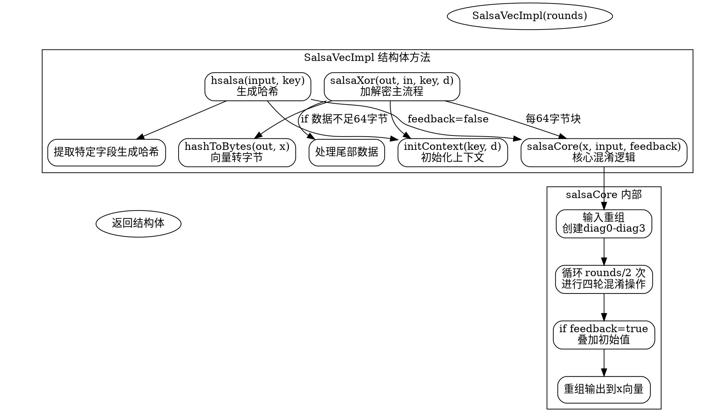

好的，我需要帮用户生成一个使用Graphviz绘制的Salsa20 Zig函数的流程图。首先，我需要仔细阅读并理解提供的代码。

首先，代码定义了一个名为SalsaVecImpl的函数，该函数返回一个结构体，包含多个方法和类型。主要方法包括initContext、salsaCore、hashToBytes、salsaXor和hsalsa。我需要确定这些函数之间的调用关系以及各自的流程。

initContext函数用于初始化上下文，构建BlockVec结构。salsaCore是核心处理函数，进行多轮的混淆操作。hashToBytes将处理后的数据转换为字节。salsaXor负责加密或解密数据流，而hsalsa用于生成哈希值。

接下来，我需要为每个主要函数绘制流程图节点，并确定它们之间的连接。例如，salsaXor会调用initContext和salsaCore，而salsaCore可能被多次调用。同时，hsalsa也会调用initContext和salsaCore，但参数不同。

需要注意循环结构，比如salsaCore中的while循环处理轮数，以及salsaXor中的循环处理数据块。这些循环应该在流程图中用条件判断和循环结构表示。

另外，错误处理部分需要检查是否有遗漏，例如在salsaXor中处理最后一个数据块时的条件判断。需要确保所有可能的执行路径都被覆盖。

最后，使用Graphviz的DOT语言来组织这些节点和边，确保结构清晰，逻辑正确。可能需要使用子图来分组相关函数，比如将salsaXor和hsalsa作为主函数，而其他作为辅助函数。

在绘制过程中，需要注意节点之间的箭头方向，正确表示调用顺序和数据流向。同时，注释每个节点的功能，使流程图更易理解。检查是否有遗漏的函数或未处理的边界条件，确保流程图的完整性和准确性。
================================================


这个流程图包含以下关键部分：

1. 主结构体方法（紫色框区域）
2. salsaCore内部实现细节（绿色框区域）
3. 主要数据流向：
   - salsaXor调用initContext初始化上下文
   - 加密时循环调用salsaCore和hashToBytes
   - 处理尾部数据的特殊分支
   - hsalsa的特殊输出处理

使用Graphviz渲染时需要注意：
1. 节点使用矩形圆角样式
2. 子图用于分组相关逻辑
3. 虚线表示结构包含关系
4. 箭头标签说明调用条件
5. 入口/出口节点用椭圆形表示

可以通过以下命令生成图片：
```bash
dot -Tpng salsa20.dot -o salsa20.png
```