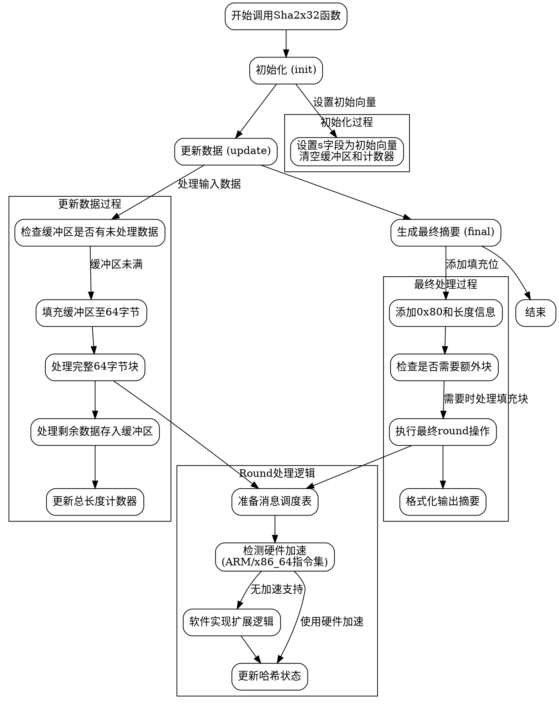

嗯，我需要为这个Zig语言的SHA2x32函数画一个流程图。首先，我得理解这个函数的结构和各个部分的作用。函数看起来是定义一个结构体，包含初始化、更新数据、最终处理等方法。

首先，函数Sha2x32接受两个参数，iv和digest_bits，返回一个结构体类型。结构体里有s、buf、buf_len、total_len这些字段。然后有很多方法，比如init、update、final等。流程图应该从入口开始，比如调用init初始化，然后update处理数据，最后final生成摘要。

可能需要分步骤来看每个方法的流程。比如update方法处理输入数据，可能分块处理，处理缓冲区中的数据，然后处理完整的块，剩下的再放到缓冲区里。final方法处理填充和长度追加，然后进行最后的处理，输出摘要。

另外，round函数是关键，处理每一块的数据，可能涉及到不同的平台优化，比如ARM和x86的指令集优化。这部分可能在流程图中需要简化，比如判断是否使用硬件加速，然后执行相应的处理步骤。

需要考虑各个步骤之间的流程，比如初始化后，多次调用update，最后调用final。每一步的数据流向，比如如何填充缓冲区，如何处理完整的块，如何更新状态变量s等。

可能还需要处理错误情况，不过这个代码里似乎没有错误处理，所以流程图可能不需要错误分支。

图形化的话，可以用不同的节点表示函数，比如init、update、final，以及它们之间的调用关系。每个函数内部的流程，比如循环处理数据块，填充缓冲区，执行round函数等。

可能需要用子图来表示每个函数的内部流程，然后用箭头连接这些子图，展示整体的处理流程。例如，主流程是init -> update -> final，而update内部可能有处理缓冲区、处理完整块、处理剩余数据等步骤。

在绘制时，要确保每个步骤清晰，逻辑正确，符合代码的结构。可能需要多次检查代码，确保流程图的每个节点都对应代码中的关键操作。
================================================
