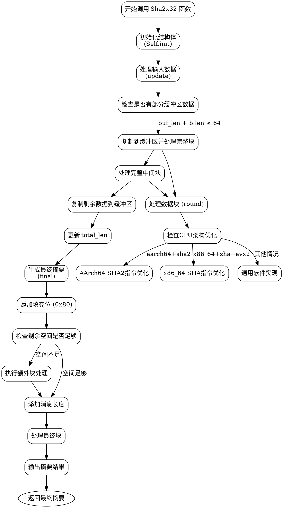

嗯，我需要为提供的Zig代码中的Sha2x32函数绘制一个流程图。首先，我得仔细阅读代码，理解它的结构和各个函数的作用。

这个函数看起来是一个SHA-256的实现，可能支持不同的变种，比如SHA-224，因为提到了digest_bits参数。结构体包含状态s、缓冲区buf、buf_len和total_len等字段。主要的方法有init、update、final，以及内部的round函数。

首先，流程图应该从入口点开始，可能是hash函数，它调用init，然后update，最后final。update处理数据块，可能会有缓冲区的管理，比如当数据不足以填满一个块时，先存到buf，等到足够时再进行处理。final处理填充和生成最终的摘要。

接下来，我需要考虑每个函数的流程。例如，update函数可能有几个分支：处理已有的缓冲区数据，处理完整的块，处理剩余的数据。而round函数可能根据不同的CPU架构（如aarch64和x86_64）有不同的实现路径，或者回退到通用实现。

对于图形表示，可能需要不同的节点表示函数，条件判断用菱形框，处理步骤用矩形框。比如，在update函数中，首先检查是否有部分缓冲区数据，如果有且加上新数据足够一个块，则处理这部分。然后处理完整的中间块，最后处理剩余的数据存入缓冲区。

在final函数中，处理填充，添加长度信息，最后生成摘要。这里需要注意的是填充的规则，比如添加0x80，补充长度到正确的位置，可能需要额外的块处理。

此外，round函数中的条件判断是否使用硬件加速（如检查CPU特性），如果是，则执行相应的汇编指令，否则使用软件实现。

流程图需要覆盖这些步骤，显示函数之间的调用关系和数据流向。可能需要为每个主要函数（init、update、final、round）创建子图，并展示它们如何交互。

需要注意的是，代码中有很多条件编译和平台相关的优化，这在流程图中可能需要用条件分支来表示，比如不同的CPU架构处理不同的路径。

总结步骤：
1. 确定主要函数和它们的调用关系。
2. 分析每个函数内的逻辑流程，包括条件分支和循环。
3. 将每个函数的流程转化为图形节点和边。
4. 确保不同函数之间的连接正确，比如update调用round，final处理最后的步骤。
5. 使用graphviz语法正确表示这些元素，避免使用mermaid。
================================================
