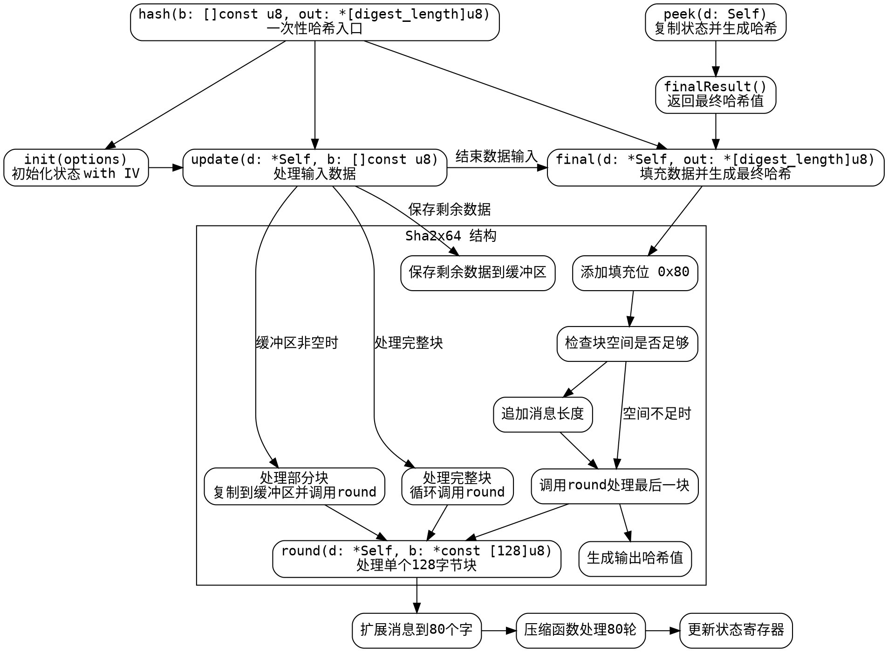

好，我需要帮助用户将提供的Zig代码（SHA2x64函数）转换为Graphviz的流程图。首先，我需要理解这段代码的结构和功能，这样才能正确地绘制出流程图。

首先，我会通读代码，了解这个Sha2x64结构体的主要组成部分。它看起来像是实现了SHA-512或类似的哈希算法，因为使用了64位的操作和特定的初始向量（iv）。该结构体包含了一些常量，如block_length、digest_length，以及方法如init、update、final、round等。

接下来，我需要确定流程图的入口点和各个函数的调用关系。入口点可能是init方法，然后依次是update处理数据，最后是final生成摘要。round方法在update和final中被调用来处理每个数据块。

然后，我需要考虑各个方法之间的数据流向和控制结构。例如，update方法处理输入数据，可能会分块处理，每次处理128字节，并调用round方法。final方法处理填充和生成最终的哈希值，同样会调用round方法。

在绘制流程图时，需要注意各个步骤的条件判断，例如在update中处理部分块和完整块的情况，以及在final中处理填充和长度追加的逻辑。此外，round方法中的循环和位操作也需要适当表示。

由于用户要求使用Graphviz而不是Mermaid，我需要确保使用正确的Graphviz语法，包括节点、边、子图等元素。可能需要将整个结构体作为一个主图，然后为每个方法创建子图，显示它们的内部流程和相互调用关系。

需要注意的是，代码中的一些细节，例如循环展开、位运算、以及常量的使用，可能需要在流程图中以注释或简化的方式表示，避免过于复杂。例如，round方法中的循环展开可能可以简化为一个处理步骤，而不需要详细画出每个循环迭代。

最后，检查流程图是否覆盖了所有主要的方法和逻辑分支，确保没有遗漏关键步骤，如数据块的填充、长度计算、哈希值的生成等。
================================================

该流程图使用以下约定：
1. 黄色方框表示结构体方法
2. 蓝色菱形表示条件判断
3. 绿色圆角框表示核心处理函数
4. 箭头标注显示主要数据流向
5. 子图展示结构体内部逻辑
6. 外部接口单独列出显示调用关系

可以通过Graphviz工具渲染生成矢量图，建议使用`dot -Tsvg sha2x64.dot -o sha2x64.svg`命令生成可视化结果。