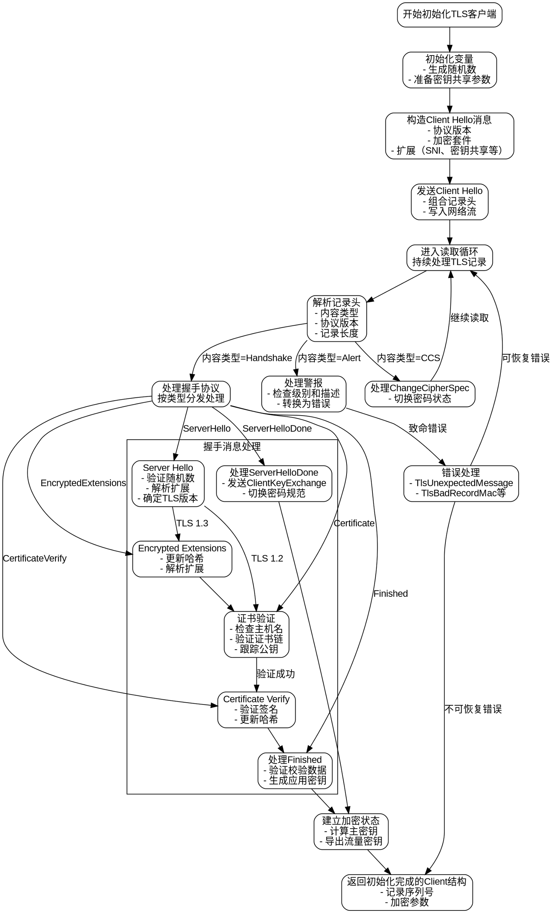

嗯，我需要为这个用 Zig 编写的 TLS 客户端初始化函数绘制流程图。首先，我得理解这个函数的主要步骤和逻辑结构。看起来这个函数处理 TLS 握手过程，包括发送 Client Hello，处理 Server Hello，证书验证，密钥交换，以及最终的加密通信建立。

首先，函数初始化一些变量，比如随机数缓冲区、密钥共享参数等。然后构造 Client Hello 消息，包括支持的协议版本、加密套件、扩展等。接下来，发送 Client Hello 到服务器，并等待响应。

在处理服务器响应的部分，函数进入一个循环，不断读取和处理 TLS 记录。根据不同的内容类型（如握手、警报、更改密码规范等），执行不同的逻辑。特别是处理 Server Hello、Encrypted Extensions、Certificate、Certificate Verify、Finished 等握手消息。

在证书验证阶段，需要检查主机名是否匹配，验证证书链的有效性。密钥交换部分涉及生成共享密钥，并根据 TLS 版本（1.2 或 1.3）进行不同的处理。最后，建立应用层加密通信所需的参数，并返回初始化完成的客户端结构。

在绘制流程图时，需要将这些步骤分解为不同的节点，并用箭头表示控制流。可能的分支包括错误处理、不同 TLS 版本的处理路径、证书验证的成功与失败等。同时，循环结构（如读取和处理多个 TLS 记录）也需要在流程图中体现。

需要注意函数中的条件判断和错误处理，比如 switch 语句中的不同情况，try 表达式可能引发的错误，这些都需要在流程图中明确标出。此外，各个子过程（如密钥交换、证书解析）可以作为子流程或单独节点。

可能的结构是先开始于函数入口，然后依次处理 Client Hello 的构造和发送，进入读取循环，处理不同的记录类型，逐步完成握手过程，最后返回初始化后的 Client 结构。每个主要步骤需要分解为具体的操作和判断条件。
================================================
