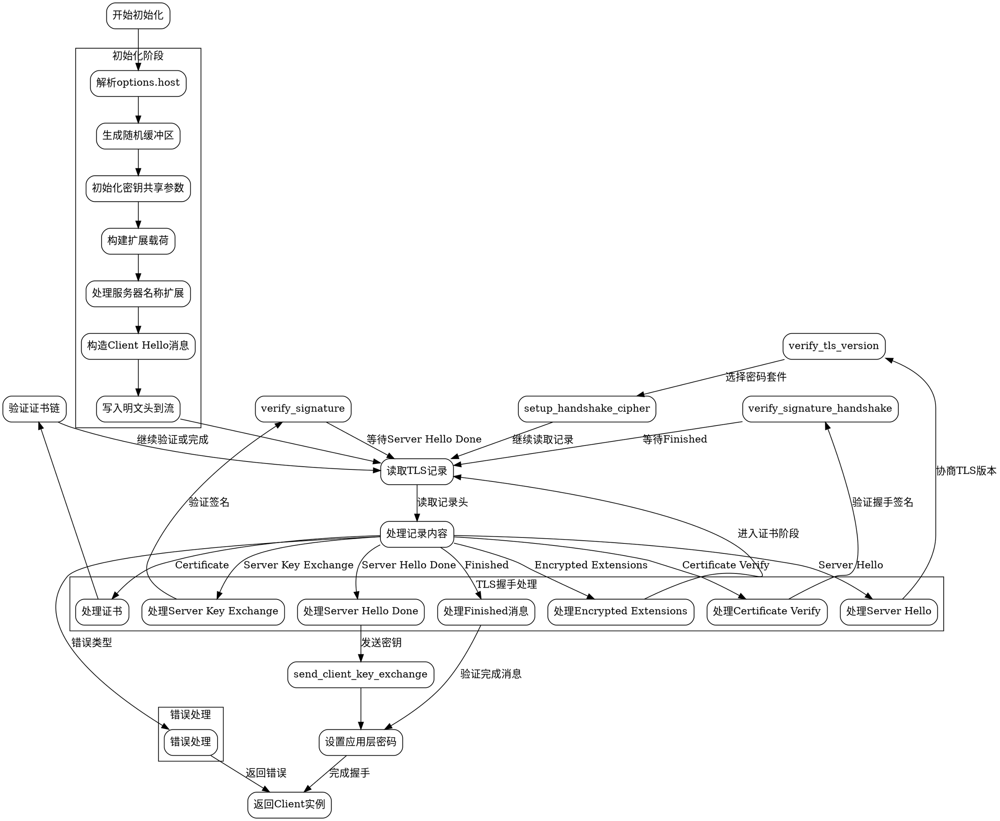

好的，我需要为这个Zig语言编写的TLS客户端初始化函数绘制一个流程图。首先，我需要理解这个函数的结构和逻辑流程。函数名为`init`，它接受一个流和选项，返回一个客户端实例或错误。

首先，函数开始处理`options.host`，根据不同的情况设置`host`和`host_len`。接着生成随机缓冲区，初始化各种变量如`client_hello_rand`、`key_share`等。然后构造扩展载荷，包括支持的版本、签名算法、支持的组等。

接下来处理服务器名称扩展，根据是否进行主机验证来调整扩展的长度。然后构建客户端Hello消息，包括协议版本、随机数、会话ID、密码套件等。构造明文头并写入流中。

之后进入一个循环处理TLS记录，根据不同的内容类型（如握手、警报、更改密码规范等）进行不同的处理。处理服务器Hello消息，协商TLS版本和密码套件，进行密钥交换。根据TLS版本（1.3或1.2）处理不同的握手状态，如加密扩展、证书验证、证书链建立等。

在处理证书时，验证主机名和证书链的有效性。处理服务器密钥交换消息，验证签名。最后处理完成消息，生成应用层密码，完成握手过程，返回客户端实例。

在绘制流程图时，需要将这些步骤分解为不同的节点，包括条件判断（如TLS版本、握手状态）、循环处理记录、错误处理等。每个主要操作如构造客户端Hello、处理服务器Hello、密钥交换、证书验证等都应作为流程图的节点。使用条件分支表示不同的处理路径，例如根据`options.host`的选择，TLS版本的不同处理逻辑，以及握手状态的变化。

需要注意的是，函数中有多个状态变量，如`handshake_state`和`cipher_state`，这些状态的变化会影响流程的走向。此外，错误处理部分需要明确标注可能的错误退出路径。

最后，确保流程图的结构清晰，层次分明，正确反映函数的执行流程，包括循环和条件分支。使用Graphviz的语法来定义节点和边，合理分组相关操作，使流程图易于理解。
================================================
