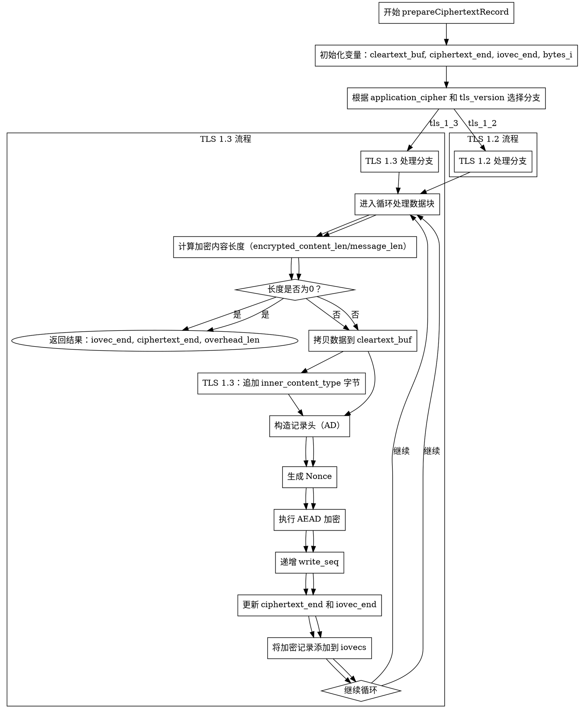

嗯，我需要为这个Zig函数prepareCiphertextRecord绘制流程图。首先，我得仔细看看这个函数的结构。函数处理TLS记录的加密，根据不同的TLS版本（1.3和1.2）有不同的处理逻辑。

函数开始部分定义了一些变量，如cleartext_buf、ciphertext_end、iovec_end和bytes_i。然后有一个switch语句，根据c.application_cipher和c.tls_version进入不同的分支。对于TLS 1.3和1.2，处理方式不同，比如加密方式、头部结构、nonce生成等。

首先，我需要理清整个函数的控制流。主switch分为TLS 1.3和1.2两个大分支，每个分支内都有一个无限循环，处理数据的分块加密，直到数据全部处理完毕。每个循环中计算加密内容长度，拷贝数据到cleartext_buf，生成AD（Additional Data），构造nonce，执行加密，更新指针和序列号，最后将加密后的记录添加到iovecs中。

需要注意的是循环中的退出条件：当encrypted_content_len或message_len为0时返回结果。这发生在数据已经处理完或者缓冲区空间不足时。

接下来，流程图的节点应该包括函数入口、变量初始化、switch分支判断、循环处理、加密操作、指针更新、记录添加到iovecs，以及循环结束条件判断和返回结果。

可能的分支和循环结构需要正确表示，特别是TLS版本的不同处理路径。同时，要注意每个分支内部的步骤，如生成nonce、加密、更新write_seq等。

需要确保流程图中的每个步骤都有对应的节点，并且箭头正确连接，尤其是循环部分。可能使用菱形节点表示条件判断，矩形节点表示处理步骤，箭头表示流程方向。

另外，要注意处理TLS 1.3和1.2的不同之处，比如AD的构造方式、nonce的生成方法、加密参数的不同（如AEAD的tag_length、record_iv_length等）。这些差异需要在流程图中明确区分。

最后，生成Graphviz的DOT代码，使用正确的语法结构，如子图（subgraph）来区分不同TLS版本的流程，确保结构清晰。
================================================
