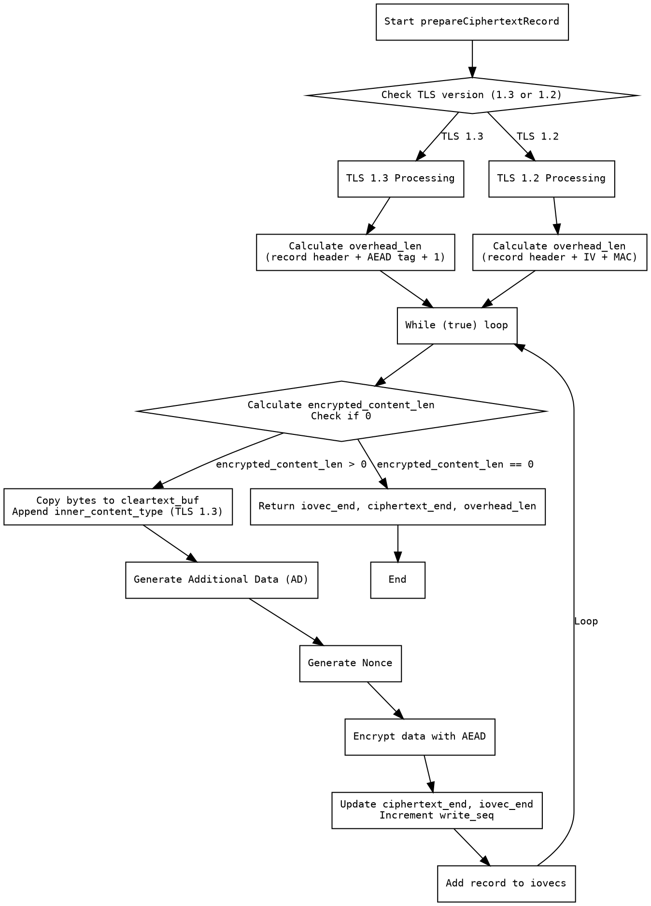

嗯，我需要为这个Zig函数`prepareCiphertextRecord`画一个流程图。首先，我得理解这个函数的结构和逻辑。这个函数处理TLS客户端加密记录的准备工作，根据TLS版本（1.3或1.2）有不同的处理分支。看起来函数主要分为两个大块：处理TLS 1.3和处理TLS 1.2的情况。

首先，函数开始时会根据`c.application_cipher`和`c.tls_version`进行分支判断。这里用了`inline else`和`switch`，可能是在匹配不同的加密套件和TLS版本。然后针对每个TLS版本，有不同的加密流程。比如TLS 1.3使用了AEAD加密，而TLS 1.2可能涉及MAC和显式IV。

接下来，我需要理清每个分支中的循环逻辑。两个版本都有一个`while (true)`循环，用于处理分块加密数据。循环内部会计算加密内容的长度，复制明文到缓冲区，生成加密所需的附加数据（AD）、nonce，执行加密操作，并更新缓冲区指针和计数器。

需要注意的是，每个循环中都有对`bytes`的分块处理，以及生成对应的密文记录。此外，还有对`write_seq`的递增和可能的溢出处理（比如发送key_update）。

可能的流程步骤大致如下：
1. 检查TLS版本，进入对应的处理分支。
2. 计算每个记录的开销（overhead_len）。
3. 进入循环，处理数据直到所有字节处理完毕。
4. 在每次循环中，确定当前块的长度。
5. 复制明文到缓冲区，并添加内容类型字节（TLS 1.3的情况）。
6. 生成记录头（AD）、nonce，执行加密。
7. 更新缓冲区和计数器。
8. 将生成的记录添加到iovecs中。
9. 循环直到数据全部处理完毕，返回结果。

在画流程图时，应该将这些步骤用不同的节点表示，并用条件判断来区分TLS版本和循环中的终止条件。另外，注意错误处理和可能的溢出检查（比如`write_seq`递增后的处理）。

可能遇到的困难是处理循环中的条件判断，比如如何判断数据是否处理完毕，以及如何正确连接各个步骤。需要确保每个分支的流程清晰，特别是TLS 1.3和1.2之间的差异部分。

最后，用Graphviz的DOT语言将这些步骤和判断绘制成流程图，使用菱形表示条件判断，矩形表示处理步骤，箭头连接流程。
================================================

该流程图展示了以下逻辑：
1. 函数入口根据TLS版本选择分支
2. 分别处理TLS 1.3和1.2的开销计算
3. 进入循环处理数据分块
4. 每次循环：
   - 计算可加密数据长度
   - 数据长度为0时退出循环
   - 复制明文并处理内容类型（TLS 1.3特有）
   - 生成附加认证数据（AD）
   - 生成Nonce
   - 执行加密操作
   - 更新缓冲区和序列号
   - 将加密记录加入发送队列
5. 循环结束后返回结果参数

对于TLS 1.2分支，流程类似但有以下差异：
- 开销计算包含显式IV和MAC
- 不需要追加内容类型字节
- Nonce生成方式不同
- 显式处理记录IV