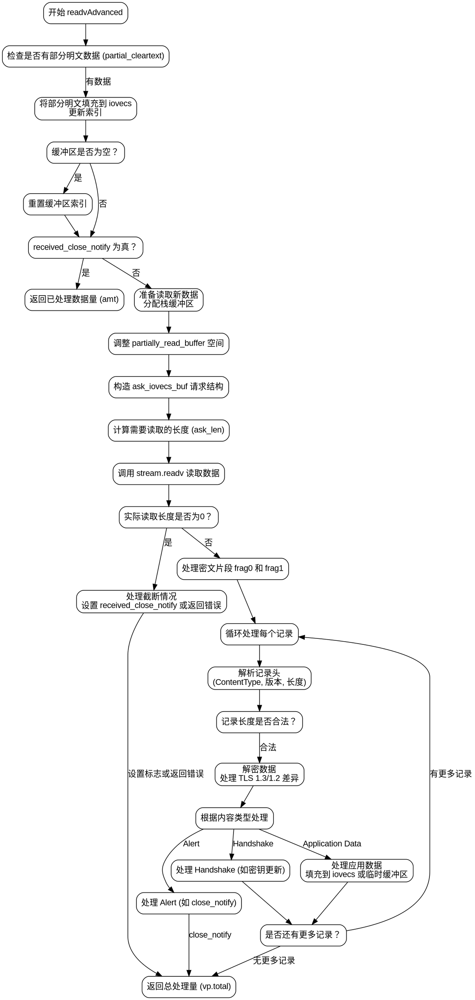

好的，我现在需要为这个用Zig编写的TLS客户端函数`readvAdvanced`绘制一个流程图。首先，我得仔细阅读并理解这个函数的逻辑，然后将其分解成不同的步骤和判断条件，这样才能准确地画出流程图。

首先，函数开始于`readvAdvanced`，它接受一个客户端指针、一个流和iovecs数组。函数的主要职责是处理从流中读取数据，进行TLS解密，并将明文数据填充到提供的iovecs缓冲区中。

第一步，函数创建了一个`VecPut`结构体`vp`，用于管理iovecs。然后检查是否有部分未处理的明文数据存在于`partially_read_buffer`中。如果有，就尝试将这些数据放入`vp`中，并更新相关的索引。如果处理完这部分数据后缓冲区变空，或者已经接收到关闭通知，就直接返回处理的数据量。

接下来，如果部分明文数据不足以满足请求，函数会继续处理接收到的密文数据。这里涉及到一些缓冲区的准备，比如`cleartext_stack_buffer`和`in_stack_buffer`，用于处理可能的分段记录。然后调整`partially_read_buffer`的空间，确保有足够的空间处理新的密文记录。

之后，函数构造了`ask_iovecs_buf`，用于从流中读取数据。计算需要读取的长度，并调用`stream.readv`来获取密文数据。如果读取到的数据长度为0，可能表示连接被截断，根据配置决定是否允许这种情况，否则返回错误。

读取到数据后，处理可能的密文记录分片情况。这里需要处理两个片段`frag0`和`frag1`，可能需要将跨片段的记录合并处理。循环处理每个记录，解析TLS记录头，解密数据，并根据内容类型（如警报、握手、应用数据）进行不同的处理。

对于应用数据，解密后的明文会被放入`vp`指向的缓冲区，或者临时栈缓冲区，再复制到用户缓冲区。如果遇到关闭通知，则设置相应标志并返回。处理过程中还需要处理密钥更新等握手消息，更新相关的密钥和序列号。

整个流程中有很多条件判断，比如检查缓冲区是否为空、处理跨片段记录、解密后的内容类型处理等。每个步骤都需要在流程图中明确表示出来，包括循环和分支路径。

在绘制流程图时，需要注意以下几点：
1. 开始和结束节点。
2. 处理部分明文数据的初始步骤。
3. 读取新数据并处理可能的截断情况。
4. 解密记录的循环处理，包括跨片段记录的处理。
5. 根据内容类型分派到不同的处理逻辑。
6. 处理密钥更新和关闭通知的情况。
7. 最终将数据填充到iovecs并返回。

需要确保每个判断条件（如是否有部分数据、读取是否成功、记录类型等）都有对应的分支，并且流程图的箭头正确表示执行顺序。同时，循环部分（如处理多个记录）需要用合适的结构表示，比如循环节点或返回箭头。

可能会遇到的难点在于处理跨片段记录的逻辑，这部分需要仔细分解步骤，确保流程图的每个判断和操作都准确反映代码逻辑。此外，密钥更新和不同TLS版本（如1.2和1.3）的处理可能需要在流程图中有所区分，但根据代码结构，这部分可能被封装在条件分支中，需要在流程图中适当体现。

最后，确保流程图符合Graphviz的语法，使用正确的节点和箭头表示，避免使用Mermaid的语法。
================================================
