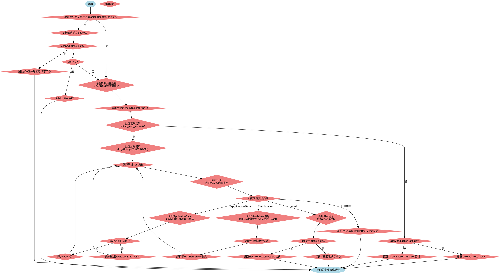

好的，我需要为这个用Zig编写的TLS客户端`readvAdvanced`函数绘制一个流程图。首先，我需要理解这个函数的结构和逻辑流程。

首先，函数`readvAdvanced`似乎负责从流中读取数据，处理TLS记录，包括解密和验证。函数中有很多条件判断和循环，需要理清每个步骤的顺序和分支。

1. **初始部分**：函数开始时会处理`partially_read_buffer`中已有的明文数据。如果有部分明文可用，会尝试将其复制到用户提供的`iovecs`中。这部分处理完后，可能会返回已复制的字节数，或者继续读取更多数据。

2. **读取加密数据**：如果没有足够的明文数据，函数会准备从流中读取加密数据。这里涉及到分配缓冲区，包括`cleartext_stack_buffer`和`in_stack_buffer`，以及处理可能的缓冲区重叠。

3. **解密处理**：读取加密数据后，需要解析TLS记录，处理可能的记录分片（比如一个记录跨越两个缓冲区）。这里涉及到循环处理每个记录，解密，验证MAC，处理警报（如close_notify），处理握手消息（如NewSessionTicket、KeyUpdate）等。

4. **处理解密后的数据**：解密后的数据可能需要复制到用户缓冲区，或者暂存到`partially_read_buffer`中，以备后续读取。

5. **错误处理**：在解密过程中可能会遇到各种错误，如TlsBadRecordMac、TlsDecodeError等，需要正确处理这些错误路径。

接下来，我需要将这些步骤转化为流程图中的节点和分支。可能的节点包括：

- 开始
- 检查部分明文缓冲区
- 复制部分明文到iovecs
- 判断是否收到close_notify
- 准备读取加密数据
- 从流中读取数据
- 处理读取结果（包括可能的截断攻击判断）
- 解析TLS记录头
- 处理分片记录
- 解密记录
- 处理不同类型的记录（Alert、Handshake、ApplicationData等）
- 更新序列号和处理密钥更新
- 错误处理分支
- 结束返回

需要注意循环结构，比如处理多个记录的循环，以及可能的递归处理分片记录的情况。此外，条件分支较多，如是否允许截断攻击、是否收到关闭通知、记录类型判断等。

在绘制流程图时，需要使用不同的形状表示开始/结束、处理步骤、判断分支等。例如：

- 椭圆形表示开始和结束
- 矩形表示处理步骤
- 菱形表示判断分支
- 箭头表示流程方向

需要确保每个判断分支都有明确的“是”和“否”路径，并且循环结构正确闭合。

可能需要将复杂的处理步骤分解为子流程，例如解密过程或处理握手消息的具体步骤，以保持主流程图的清晰。但根据用户的要求，可能需要在主流程图中包含足够细节，而无需分解为子图。

最后，需要根据代码中的具体条件，如`if (partial_cleartext.len > 0)`、`if (c.received_close_notify)`、循环`while (true)`等，正确映射到流程图的各个分支和循环。
================================================
