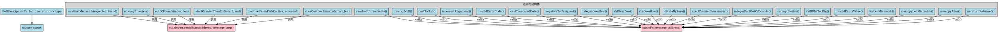

好的，我现在需要帮用户分析他们提供的Zig代码，并生成一个Graphviz的流程图。首先，我得仔细阅读这段代码，理解它的结构和各个部分的功能。

用户提供的代码是一个名为FullPanic的函数，返回一个结构体类型。看起来这个结构体定义了一系列错误处理函数，每个函数在遇到特定错误时调用panic函数，终止程序运行。每个函数都带有@branchHint(.cold)属性，可能是提示编译器这部分代码不常执行，优化分支预测。

接下来，我需要确定如何将这段代码转化为流程图。流程图通常展示函数之间的调用关系或控制流。这里的FullPanic函数返回的结构体包含多个静态方法，每个方法处理不同的错误情况。因此，流程图可能需要展示这些方法如何调用panicFn或std.debug.panicExtra。

首先，结构体的入口是FullPanic函数，它接受一个panicFn作为参数。返回的结构体中，每个方法（如sentinelMismatch、unwrapError等）在错误发生时调用panicFn或直接调用std.debug.panicExtra。例如，sentinelMismatch调用std.debug.panicExtra，而unwrapNull则调用call（即传入的panicFn）。

需要注意的是，某些方法直接调用call，而另一些则调用std.debug.panicExtra。这可能是因为不同的错误类型需要不同的处理方式，但都是由同一个panicFn处理。或者，call可能被设置为默认的panic函数，而有些情况需要更详细的错误信息，所以直接调用panicExtra。

接下来，我需要确定流程图的节点和连接关系。主函数FullPanic生成一个结构体，结构体的各个方法作为子节点。每个方法内部的处理逻辑可能需要展示它们如何调用panic函数。但由于所有方法都是终止程序的noreturn，流程图中不会有返回或继续执行的箭头，每个方法执行后结束。

可能的节点包括：

1. FullPanic函数作为入口点。
2. 结构体的各个方法（sentinelMismatch、unwrapError等）。
3. 每个方法调用panicFn或panicExtra的情况。

但是，Graphviz流程图更注重流程而非结构体内部的方法组织。可能需要将每个方法视为独立的节点，并展示它们的调用关系。例如，当某个方法被调用时，它会触发panic函数，导致程序终止。

然而，考虑到所有方法都是直接触发panic，没有复杂的调用链，流程图可能比较简单。每个方法节点连接到它们调用的panic函数节点，或者直接标注它们的触发条件。

另外，用户特别强调不要错误使用Mermaid，必须用Graphviz。因此，我需要确保生成的代码是DOT语言格式，正确使用节点和边的关系。

可能的步骤：

1. 确定所有需要表示的节点，包括FullPanic结构体、各个方法、panicFn和std.debug.panicExtra。
2. 绘制结构体与方法之间的关系，即结构体包含这些方法。
3. 绘制每个方法调用panic函数或panicExtra的边。
4. 标注每个方法的触发条件或错误类型。

例如，结构体作为父节点，各个方法作为子节点，每个子节点连接到它们调用的panic函数节点。这样，流程图展示当某个错误发生时，对应的方法被调用，进而触发panic，终止程序。

需要注意的是，有些方法直接调用call（即panicFn），而另一些调用std.debug.panicExtra。需要区分这两种情况，可能用不同的边或颜色表示。

总结，流程图的结构可能如下：

- FullPanic函数生成一个结构体。
- 结构体包含多个方法节点。
- 每个方法节点连接到它们调用的panic函数（call或panicExtra）。
- panic函数节点表示程序终止。

现在，我需要用DOT语言表示这个结构。使用子图来分组结构体的方法，然后用边连接方法到对应的panic调用。
================================================

该流程图使用Graphviz的DOT语言描述，包含以下特征：

1. 主函数FullPanic作为入口点，返回一个结构体类型
2. 结构体内部方法使用子图(cluster)分组展示
3. 所有方法分为两类调用：
   - 直接调用std.debug.panicExtra（前6个方法）
   - 通过call()间接调用panicFn（其余方法）
4. 不同颜色的节点区分：
   - 浅蓝色：普通函数/方法
   - 粉色：最终panic触发点
5. 箭头标注"调用"关系，清晰展示控制流程走向