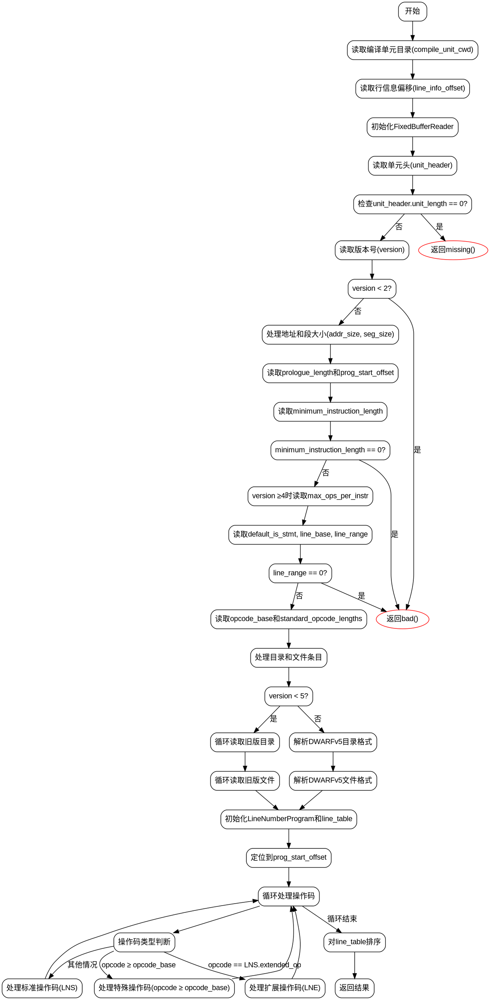

好的，我现在需要为给定的Zig函数绘制一个流程图。首先，我需要理解这个函数的结构和逻辑流程。函数名为runLineNumberProgram，看起来是处理DWARF调试信息中的行号程序。

首先，我会通读整个函数，了解各个部分的作用。函数开始部分读取编译单元的目录信息和行信息偏移量。接着使用FixedBufferReader来读取.debug_line节的内容。然后读取单元头，检查版本，处理不同版本（如v5和其他版本）的不同逻辑，比如地址大小和段大小的处理。

接下来是读取prologue长度，并定位到程序开始的位置。然后处理最小指令长度、默认的is_stmt标志、line_base、line_range、opcode_base等参数。之后根据版本不同，处理目录和文件条目。对于版本小于5的情况，通过循环读取目录和文件条目；对于v5及以上版本，使用结构化的格式解析目录和文件条目。

之后初始化行号程序（LineNumberProgram）和行表（LineTable），然后进入主循环处理操作码。这里分为扩展操作码（如LNE.end_sequence、LNE.set_address、LNE.define_file）和标准操作码（如LNS.copy、LNS.advance_pc等），每个操作码对应不同的处理逻辑。在处理完所有操作码后，对行表进行排序，最后返回结果。

在绘制流程图时，需要将上述步骤分解为不同的节点，并用箭头表示流程走向。需要注意条件判断的分支，比如版本号不同导致的不同处理逻辑，以及操作码的不同类型。同时，错误处理（如返回bad()或missing()）也需要在流程图中体现。

可能遇到的挑战是如何清晰地表达复杂的条件分支和循环结构。例如，在处理目录和文件条目时，版本小于5和v5及以上版本的处理方式不同，需要分开处理。此外，主循环中的多个操作码分支需要正确表示其处理流程。

为了确保流程图的准确性，我需要确认每个步骤之间的逻辑关系是否正确，特别是错误处理路径和条件分支。此外，需要注意函数中使用的变量和结构，确保流程图中各节点的描述准确无误。

总结来说，流程图的大致步骤包括：初始化读取基本信息、处理不同版本的目录和文件条目、处理行号程序的操作码，最后排序并返回结果。每个主要步骤下会有子步骤，特别是版本差异和操作码处理部分需要详细展开。
================================================
