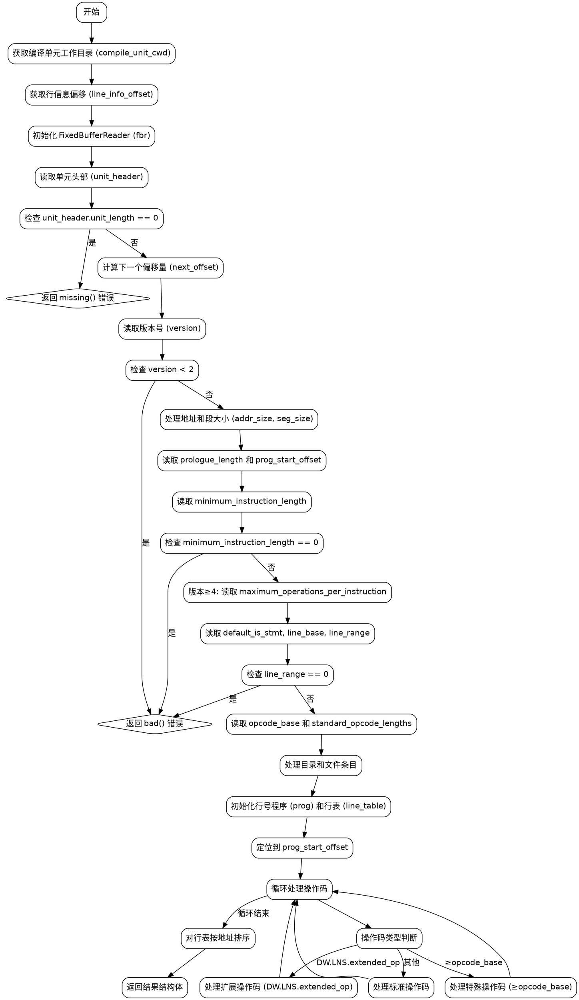

好的，我现在需要为给定的Zig函数`runLineNumberProgram`绘制流程图。首先，我需要理解这个函数的结构和逻辑。

首先，函数开始处有一些初始化操作，比如获取编译单元的当前工作目录`compile_unit_cwd`，以及行信息偏移`line_info_offset`。然后创建了一个`FixedBufferReader`实例`fbr`，用于读取调试行信息部分的内容。

接下来，函数读取单元头部`unit_header`，检查其长度是否为0，如果是则返回错误。然后确定下一个单元的偏移量`next_offset`，并读取版本号。根据版本号的不同，处理地址大小和段大小。对于版本4及以上，处理最大操作数每指令。

之后，读取一系列参数，如`minimum_instruction_length`、`default_is_stmt`、`line_base`、`line_range`、`opcode_base`和标准操作码长度。然后根据DWARF版本的不同（版本5之前或之后），分别处理目录和文件条目。

对于版本5之前的处理，循环读取目录和文件条目，直到遇到空字符串为止。对于版本5及以后，使用结构化的条目格式来解析目录和文件信息。

然后初始化行号程序`prog`和行表`line_table`，并定位到程序开始位置`prog_start_offset`。进入主循环，处理每个操作码。这里分为扩展操作码（如结束序列、设置地址、定义文件）和标准操作码（如复制、前进PC、设置文件等）。特殊操作码处理地址和行的增量，并添加行表条目。

在处理完所有操作码后，对行表进行排序以确保地址递增。最后，返回包含行表、目录、文件和版本的结构。

绘制流程图时，需要将这些步骤转化为图形化的流程节点。每个主要操作（如初始化、读取头部、处理不同版本、循环处理目录/文件、处理操作码等）应作为流程中的节点。判断和循环结构需要相应的条件分支。例如，根据DWARF版本选择不同的处理路径，循环读取目录和文件直到遇到终止符，以及处理不同类型的操作码。

需要注意错误处理和资源释放，比如`defer`语句释放目录和文件条目的内存，以及在错误情况下回滚行表的初始化。

最后，确保流程图正确反映函数的控制流，包括所有可能的路径和异常处理。
================================================
