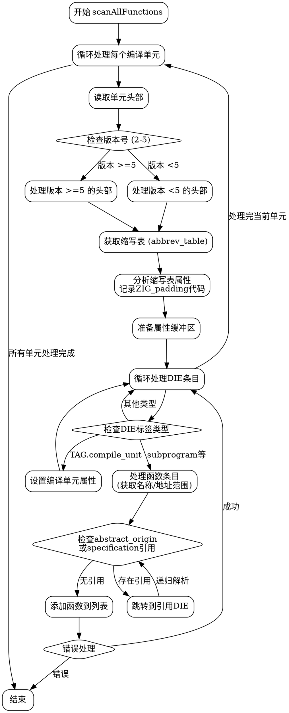

嗯，我需要为这个Zig函数生成流程图。首先，我得仔细读一遍代码，理解它的结构。这个函数叫scanAllFunctions，看起来是用来扫描DWARF调试信息中的所有函数的。函数里有一个循环处理每个编译单元（compile unit），然后解析其中的DIEs（调试信息条目），特别是子程序相关的标签，比如subprogram、inlined_subroutine等。

首先，函数开始处初始化了一个FixedBufferReader，然后进入一个while循环，处理每个编译单元。每个单元都有头部信息，读取版本号和地址大小等。接着获取缩写表（abbrev table），然后遍历所有DIE条目。对于每个DIE，根据标签类型处理，比如如果是compile_unit，就设置编译单元的信息；如果是子程序相关的标签，就提取函数名和地址范围，添加到函数列表中。

我需要确定主要的流程节点：循环处理每个编译单元，读取头部信息，处理缩写表，遍历DIE条目，处理不同类型的标签，处理函数名和地址范围，错误处理等。然后，将这些步骤用流程图的形式表示出来，包括条件判断和循环结构。

可能需要注意的条件包括版本号的检查，地址大小的验证，处理不同版本的DWARF格式，以及处理不同的DIE标签类型。错误处理部分也需要在流程图中体现，比如返回错误的情况。

接下来，我需要用Graphviz的语法将这些逻辑步骤转化为节点和边。每个主要步骤作为一个节点，条件判断作为菱形节点，循环结构用箭头连接。例如，开始节点指向处理每个编译单元的循环，循环内部分为读取头部、检查版本、处理缩写表等。处理DIE的部分会有条件判断是否是compile_unit或子程序类型，然后不同的处理分支。

最后，确保流程图的逻辑正确，覆盖所有重要的分支和循环，并且结构清晰，易于理解。
================================================
