好的，我需要为给定的Zig函数`scanAllFunctions`绘制流程图。首先，我需要仔细阅读代码，理解其逻辑结构和各个部分的功能。

函数`scanAllFunctions`的主要任务是扫描所有的调试信息单元（Dwarf），解析每个编译单元中的函数信息，并将这些函数添加到`di.func_list`中。流程大致如下：

1. **初始化读取器**：使用`FixedBufferReader`读取`.debug_info`段的内容。
2. **循环处理每个编译单元**：直到处理完所有单元。
   - **读取单元头**：获取单元长度、版本等信息。
   - **处理不同版本的单元头**：根据版本号（>=5或其他）调整读取顺序。
   - **获取缩写表**：根据`debug_abbrev_offset`获取对应的缩写表。
   - **解析缩写表**：确定最大属性数量和找到特定的`ZIG_padding`缩写码。
   - **分配属性缓冲区**：为解析DIE（调试信息条目）准备内存。
   - **处理编译单元内的DIE**：
     - **查找非填充DIE**：跳过填充和空DIE。
     - **解析DIE**：根据缩写表解析属性。
     - **处理不同标签的DIE**：
       - 如果是`compile_unit`，设置编译单元的基本信息。
       - 如果是函数相关的标签（如`subprogram`），则解析函数名称和地址范围，并添加到函数列表。
3. **移动到下一个编译单元**：更新偏移量，继续循环。

需要特别注意循环结构、条件判断（如版本检查、错误处理）以及嵌套的解析过程。绘制流程图时，应使用不同的形状表示开始/结束、处理步骤、判断节点等，并用箭头连接表示流程走向。确保涵盖所有可能的路径，包括错误处理和提前返回的情况。

可能的难点在于处理不同版本的单元头结构、递归解析`abstract_origin`和`specification`属性，以及如何管理缓冲区。需要将这些复杂部分分解为清晰的流程图节点，确保逻辑正确无误。
================================================

```graphviz
digraph G {
    node [shape=rectangle, fontname="Courier", fontsize=10];
    edge [fontname="Courier", fontsize=10];
    
    start [label="开始 scanAllFunctions"];
    init_fbr [label="初始化 FixedBufferReader"];
    loop_units [label="循环处理每个编译单元 (while)"];
    read_header [label="读取 UnitHeader"];
    check_unit_length [label="unit_length == 0?" shape=diamond];
    return_early [label="返回", shape=ellipse];
    calc_next_offset [label="计算 next_offset"];
    read_version [label="读取版本号 (version)"];
    check_version [label="version <2 或 >5?" shape=diamond];
    bad_version [label="返回 bad()", shape=ellipse];
    handle_v5 [label="处理 version >=5 的 header"];
    handle_legacy [label="处理 version <5 的 header"];
    check_address_size [label="address_size 匹配?" shape=diamond];
    get_abbrev_table [label="获取缩写表 (abbrev_table)"];
    find_max_attrs [label="计算最大属性数和 ZIG_padding 缩写码"];
    alloc_attrs_buf [label="分配属性缓冲区 (attrs_buf)"];
    setup_compile_unit [label="初始化 compile_unit 结构"];
    loop_dies [label="循环处理 DIE (while)"];
    seek_non_padding [label="定位到非填充 DIE"];
    check_next_unit [label="pos >= next_unit_pos?" shape=diamond];
    parse_die [label="解析 DIE"];
    handle_tag [label="根据 TAG 分支"];
    compile_unit_tag [label="处理 DW.TAG.compile_unit"];
    subprogram_tag [label="处理函数相关 TAG"];
    handle_abstract_origin [label="递归解析 abstract_origin/specification"];
    get_fn_name [label="获取函数名 (fn_name)"];
    handle_pc_range [label="处理 low_pc/high_pc"];
    handle_ranges [label="处理 AT.ranges"];
    append_func [label="添加到 func_list"];
    next_die [label="继续下一个 DIE"];
    next_unit [label="移动到下一个编译单元"];
    end [label="结束循环并返回", shape=ellipse];

    start -> init_fbr;
    init_fbr -> loop_units;
    
    loop_units -> read_header;
    read_header -> check_unit_length;
    check_unit_length -> return_early [label="是"];
    check_unit_length -> calc_next_offset [label="否"];
    calc_next_offset -> read_version;
    read_version -> check_version;
    check_version -> bad_version [label="是"];
    check_version -> handle_v5 [label="version >=5"];
    check_version -> handle_legacy [label="version <5"];
    handle_v5 -> check_address_size;
    handle_legacy -> check_address_size;
    check_address_size -> bad_version [label="不匹配"];
    check_address_size -> get_abbrev_table [label="匹配"];
    get_abbrev_table -> find_max_attrs;
    find_max_attrs -> alloc_attrs_buf;
    alloc_attrs_buf -> setup_compile_unit;
    setup_compile_unit -> loop_dies;
    
    loop_dies -> seek_non_padding;
    seek_non_padding -> check_next_unit;
    check_next_unit -> end [label="是"];
    check_next_unit -> parse_die [label="否"];
    parse_die -> handle_tag;
    
    handle_tag -> compile_unit_tag [label="DW.TAG.compile_unit"];
    compile_unit_tag -> setup_compile_unit [label="更新属性"];
    
    handle_tag -> subprogram_tag [label="函数相关 TAG"];
    subprogram_tag -> handle_abstract_origin;
    handle_abstract_origin -> get_fn_name;
    get_fn_name -> handle_pc_range;
    handle_pc_range -> handle_ranges [label="失败时"];
    handle_pc_range -> append_func [label="成功时"];
    handle_ranges -> append_func;
    append_func -> next_die;
    
    handle_tag -> next_die [label="其他 TAG"];
    next_die -> loop_dies;
    
    loop_units -> next_unit [label="处理完当前单元"];
    next_unit -> loop_units [label="继续循环"];
    
    end -> next_unit [style=invis];
    next_unit -> end [label="所有单元处理完毕"];
}
```
