好的，我需要为给定的Zig函数`regBytes`绘制一个流程图。首先，我需要理解这个函数的结构和逻辑。这个函数主要处理不同操作系统和CPU架构下的寄存器字节获取，存在多个条件分支。

首先，函数开始检查是否是Windows系统。如果是，根据不同的CPU架构（x86、x86_64、aarch64等）和寄存器号进行不同的处理。每个架构下都有对应的switch语句处理寄存器号，返回相应的字节数据或错误。

如果操作系统不是Windows，接着检查是否支持ucontext。如果不支持，返回错误。否则，根据不同的CPU架构和操作系统，再次进行详细的分支处理。例如，对于x86架构下的Linux、NetBSD等系统，有不同的寄存器号映射；x86_64架构下又细分Linux、FreeBSD、OpenBSD、macOS等不同的处理逻辑。ARM和AArch64架构也有各自的处理方式。

在绘制流程图时，需要注意各个条件分支的层次结构。主流程从判断操作系统开始，然后根据不同的架构和操作系统进入不同的子流程。每个子流程内部可能还有进一步的判断，比如寄存器号的范围检查，或者是否需要额外的寄存器上下文信息。

我需要确保流程图能够清晰地展示这些嵌套的条件判断，使用不同的节点表示判断、处理步骤和错误返回。例如，使用菱形节点表示条件判断，矩形节点表示处理步骤，椭圆形节点表示开始和结束，以及错误返回。

另外，注意到在某些情况下（如x86的reg_number 4和5），存在更复杂的条件判断，需要根据寄存器上下文（reg_context）的某些属性来决定如何获取寄存器值。这部分也需要在流程图中体现出来，可能作为子流程或附加条件分支。

最后，确保所有的错误情况（如InvalidRegister、UnimplementedArch、RegisterContextRequired等）都有对应的处理节点，并在流程图中正确连接。

总结步骤：
1. 确定主流程的起始点。
2. 根据操作系统分支（Windows vs 非Windows）。
3. 对每个操作系统分支，按CPU架构进一步分支。
4. 在每个架构分支下，处理不同的寄存器号，可能涉及更细的操作系统判断。
5. 处理特殊情况，如需要寄存器上下文的情况。
6. 添加所有错误处理路径。
7. 使用合适的图形符号表示判断、处理步骤和错误，保持结构清晰。
================================================

```graphviz
digraph regBytes_flowchart {
    node [shape=rectangle, fontname="Courier", fontsize=10];
    edge [fontname="Courier", fontsize=10];

    start [label="开始 regBytes", shape=ellipse];
    end [label="返回寄存器字节或错误", shape=ellipse];
    check_os_windows [label="builtin.os.tag == .windows?", shape=diamond];
    handle_windows [label="处理 Windows 分支"];
    check_have_ucontext [label="std.debug.have_ucontext?", shape=diamond];
    error_thread_context [label="return error.ThreadContextNotSupported", shape=box];
    handle_non_windows [label="处理非 Windows 分支"];
    check_cpu_arch [label="switch (builtin.cpu.arch)", shape=diamond];
    error_unimplemented_arch [label="return error.UnimplementedArch", shape=box];
    subgraph cluster_windows {
        label="Windows 处理";
        win_arch_x86 [label="x86: switch(reg_number)"];
        win_arch_x86_64 [label="x86_64: switch(reg_number)"];
        win_arch_aarch64 [label="aarch64: switch(reg_number)"];
        win_error_invalid_reg [label="return error.InvalidRegister", shape=box];
        win_error_unimplemented [label="return error.UnimplementedArch", shape=box];
    }
    subgraph cluster_non_windows {
        label="非 Windows 处理";
        nonwin_arch_x86 [label="x86: switch(os.tag)"];
        nonwin_arch_x86_64 [label="x86_64: switch(os.tag)"];
        nonwin_arch_arm [label="arm: switch(os.tag)"];
        nonwin_arch_aarch64 [label="aarch64: switch(os.tag)"];
        os_linux_x86 [label="Linux/NetBSD/Solaris: switch(reg_number)"];
        os_linux_x86_64 [label="Linux/Solaris/Illumos: switch(reg_number)"];
        os_freebsd_x86_64 [label="FreeBSD: switch(reg_number)"];
        os_openbsd_x86_64 [label="OpenBSD: switch(reg_number)"];
        os_macos_x86_64 [label="macOS/iOS: switch(reg_number)"];
        reg_context_check [label="reg_context required? (reg_number=4/5)", shape=diamond];
        error_reg_context [label="return error.RegisterContextRequired", shape=box];
        error_invalid_reg [label="return error.InvalidRegister", shape=box];
        error_unimplemented_os [label="return error.UnimplementedOs", shape=box];
    }

    start -> check_os_windows;
    check_os_windows -> handle_windows [label="是"];
    check_os_windows -> check_have_ucontext [label="否"];
    check_have_ucontext -> handle_non_windows [label="是"];
    check_have_ucontext -> error_thread_context [label="否"];
    handle_windows -> check_cpu_arch;
    check_cpu_arch -> win_arch_x86 [label=".x86"];
    check_cpu_arch -> win_arch_x86_64 [label=".x86_64"];
    check_cpu_arch -> win_arch_aarch64 [label=".aarch64"];
    check_cpu_arch -> win_error_unimplemented [label="其他"];
    win_arch_x86 -> win_error_invalid_reg [label="默认"];
    win_arch_x86_64 -> win_error_invalid_reg [label="默认"];
    win_arch_aarch64 -> win_error_invalid_reg [label="默认"];
    handle_non_windows -> check_cpu_arch;
    check_cpu_arch -> nonwin_arch_x86 [label=".x86"];
    check_cpu_arch -> nonwin_arch_x86_64 [label=".x86_64"];
    check_cpu_arch -> nonwin_arch_arm [label=".arm"];
    check_cpu_arch -> nonwin_arch_aarch64 [label=".aarch64"];
    check_cpu_arch -> error_unimplemented_arch [label="其他"];
    nonwin_arch_x86 -> os_linux_x86 [label="Linux/NetBSD/Solaris"];
    nonwin_arch_x86 -> error_unimplemented_os [label="其他"];
    os_linux_x86 -> reg_context_check [label="reg_number=4/5"];
    reg_context_check -> error_reg_context [label="reg_context==null"];
    reg_context_check -> error_invalid_reg [label="其他条件"];
    nonwin_arch_x86_64 -> os_linux_x86_64 [label="Linux/Solaris/Illumos"];
    nonwin_arch_x86_64 -> os_freebsd_x86_64 [label="FreeBSD"];
    nonwin_arch_x86_64 -> os_openbsd_x86_64 [label="OpenBSD"];
    nonwin_arch_x86_64 -> os_macos_x86_64 [label="macOS/iOS"];
    nonwin_arch_x86_64 -> error_unimplemented_os [label="其他"];
    os_linux_x86_64 -> error_invalid_reg [label="默认"];
    os_freebsd_x86_64 -> error_invalid_reg [label="默认"];
    os_openbsd_x86_64 -> error_invalid_reg [label="默认"];
    os_macos_x86_64 -> error_invalid_reg [label="默认"];
    nonwin_arch_arm -> error_unimplemented_os [label="非 Linux"];
    nonwin_arch_aarch64 -> error_unimplemented_os [label="特定 OS 分支"];
    handle_windows -> end;
    handle_non_windows -> end;
    error_thread_context -> end;
    error_unimplemented_arch -> end;
    error_reg_context -> end;
    error_invalid_reg -> end;
    error_unimplemented_os -> end;
    win_error_invalid_reg -> end;
    win_error_unimplemented -> end;
}
```
