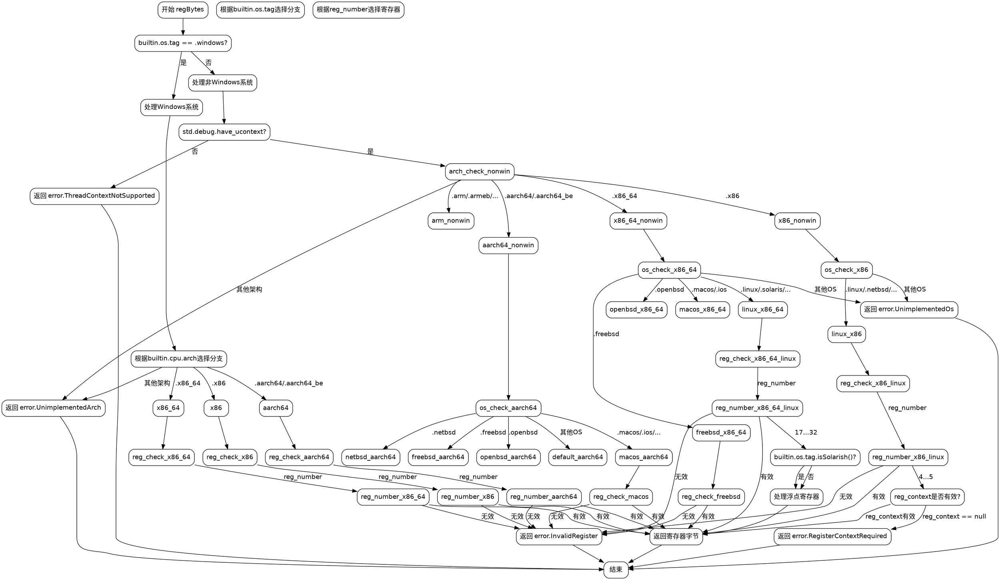

好的，我需要为这个Zig函数绘制流程图。首先，我需要理解这个函数的结构和逻辑。函数名为regBytes，根据不同的操作系统和架构返回寄存器的字节表示。

首先，函数检查当前操作系统是否为Windows。如果是，则根据不同的CPU架构（如x86、x86_64、aarch64等）处理寄存器编号。每个架构都有一个switch语句，根据reg_number返回相应的寄存器字节。

如果不是Windows，则检查是否支持ucontext。如果不支持，返回错误。接着，根据不同的CPU架构和操作系统，再次处理寄存器编号。例如，对于x86架构的Linux、NetBSD等系统，有不同的寄存器映射，并且某些情况需要RegisterContext参数。

流程图中需要涵盖以下几个主要分支：
1. 操作系统是否为Windows？
2. CPU架构的判断（x86、x86_64、aarch64等）。
3. 不同操作系统下的具体处理逻辑（如Linux、FreeBSD、macOS等）。
4. 寄存器编号的有效性检查，以及错误处理。

需要注意条件嵌套的层次，例如在Windows分支下，先判断架构，再处理reg_number；在非Windows分支下，先判断是否支持ucontext，再根据架构和操作系统处理。

可能出现的错误包括InvalidRegister、UnimplementedArch、UnimplementedOs等，这些也需要在流程图中体现。

最后，确保流程图清晰展示所有判断和返回路径，包括正常返回和错误返回。
================================================
