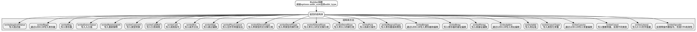

嗯，用户让我用Graphviz来画这个Zig函数的流程图。首先，我需要理解这个函数的结构。看起来这是一个Builder函数，返回一个结构体，里面有很多方法，比如writeOpcode、writeLiteral等等。每个方法似乎处理不同的操作码写入逻辑。

首先，我得确定流程图的入口点。函数开始于pub fn Builder(comptime options: Options) type，然后定义了一个addr_type的变量，根据options.addr_size的不同选择不同的类型。接着返回一个结构体，里面包含多个写入方法。

接下来，我需要考虑如何将这些方法组织成流程图。可能需要从Builder函数开始，然后分支到各个writeXxx方法。每个方法内部有各自的逻辑，比如条件判断、循环等。例如，writeOpcode中有switch语句检查opcode是否有效，不同的case处理不同的情况。

不过Graphviz的流程图通常比较线性，展示函数之间的调用关系或者控制流程。这里的Builder返回一个结构体，结构体的方法之间可能没有直接的调用关系，而是各自独立的。因此，可能需要将每个方法作为一个节点，展示它们属于Builder返回的结构体。

另外，需要考虑条件判断，例如在writeOpcode中，如果options.call_frame_context为真且opcode无效，则返回错误。这种情况下，可以在流程图中添加条件分支。

可能的结构是：

1. Builder函数开始，定义addr_type。
2. 返回的结构体包含多个方法节点。
3. 每个方法节点内部有各自的处理逻辑，比如条件判断、写入操作等。

但这样可能会很复杂，尤其是每个方法内部的细节。用户可能希望一个高层次的流程图，展示主要函数和方法的结构，而不是每个方法的内部细节。

因此，流程图可能以Builder函数为起点，然后显示它返回的结构体，结构体内部列出各个write方法。对于每个方法，可以简要说明其功能，比如writeOpcode处理零操作数指令，writeLiteral处理字面量编码等。

此外，需要注意Graphviz的语法，使用digraph，节点和边的定义。可能需要使用子图来将结构体的方法组织在一起。

例如：

digraph Builder {
    node [shape=rectangle];
    Builder -> Struct;
    Struct [label="返回的结构体"];
    Struct -> writeOpcode;
    Struct -> writeLiteral;
    Struct -> writeConst;
    // 其他方法...
    writeOpcode [label="writeOpcode: 处理零操作数指令"];
    writeLiteral [label="writeLiteral: 处理字面量编码"];
    // 其他方法的标签...
}

这样展示Builder函数生成的结构体及其包含的方法。每个方法节点可以带有简短的描述，说明其功能。

另外，某些方法内部有条件判断，例如writeConst中的switch语句处理不同的整数类型，可能需要为这些条件添加分支。但考虑到流程图不宜过于详细，可能只需在方法节点内部用注释说明主要逻辑。

总结，流程图应展示Builder函数创建的结构体，结构体包含各种写入方法，每个方法节点简要说明其功能，而不是详细绘制每个方法内部的逻辑。
================================================
