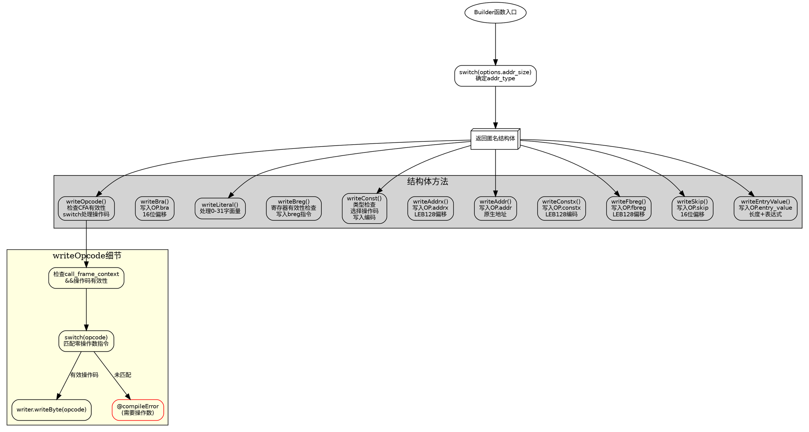

好的，我需要为提供的Zig代码绘制一个流程图。首先，我需要理解代码的结构和各个部分的功能。

这个函数`Builder`接受一个编译时的`Options`参数，并返回一个结构体类型。结构体内部定义了一系列的写操作方法，用于生成DWARF表达式。每个方法似乎处理不同的操作码（opcode）和数据编码。

首先，我会从顶层结构开始分析。`Builder`函数内部首先根据`options.addr_size`确定`addr_type`，然后返回一个匿名的结构体。这个结构体包含多个方法，如`writeOpcode`、`writeLiteral`、`writeConst`等，每个方法负责写入特定的操作码或数据到某个写入器（writer）中。

接下来，我需要为每个方法绘制流程。例如，`writeOpcode`方法检查操作码是否在调用帧上下文（call_frame_context）中有效，然后根据不同的操作码执行相应的写入操作。如果遇到不支持的操作码，会触发编译错误。

对于其他方法，如`writeConst`，需要处理不同类型的整数，并根据类型选择相应的操作码和编码方式。这里涉及到条件判断和编译时类型检查。

在绘制流程图时，应该从顶层函数开始，分支到各个方法。每个方法内部的条件判断和循环需要明确表示。例如，在`writeOpcode`中，首先检查`call_frame_context`和操作码的有效性，然后通过`switch`语句处理不同的操作码。

需要注意的是，Zig的编译时特性（如`comptime`参数）可能会影响流程的结构，但在流程图中应尽量用常规的控制结构表示。此外，错误处理（如返回错误码）也需要在流程图中体现。

可能遇到的挑战是如何将编译时逻辑（如`@compileError`）转换为流程图中的节点。这种情况下，可以将其视为终止流程的错误节点。

最后，确保流程图清晰展示函数的结构和方法之间的调用关系，使用合适的节点和箭头表示控制流和数据流。
================================================
