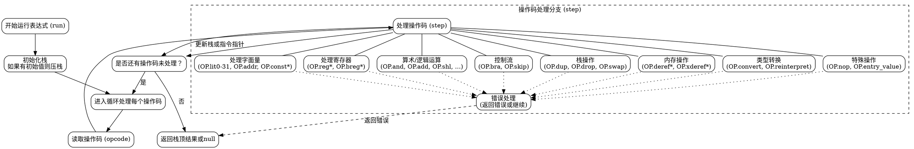

嗯，我现在需要帮用户用Graphviz画出一个Zig函数的流程图。用户提供的代码是`debug/Dwarf/expression.zig`中的`StackMachine`函数。首先，我得理解这个函数的结构和逻辑，这样才能正确地绘制流程图。

首先，这个函数是一个泛型函数，返回一个结构体类型。结构体内部有很多方法，比如`reset`、`deinit`、`readOperand`、`run`、`step`等。主要逻辑集中在`step`方法中，处理不同的操作码（opcode），执行相应的操作，比如压栈、弹栈、算术运算、控制流等。

流程图应该从`run`方法开始，初始化栈，然后进入循环调用`step`处理每个操作码，直到处理完所有表达式。每个`step`处理一个操作码，根据不同的opcode分支到不同的处理逻辑，比如处理常量、寄存器操作、算术运算、控制流跳转等。

需要注意，`step`方法中的switch语句有很多分支，每个opcode对应不同的处理流程。例如，处理`OP.addr`时，将操作数压入栈；处理`OP.and`时，弹出两个值进行按位与操作，结果压栈；处理分支指令如`OP.bra`时，根据条件调整指令流的位置。

在绘制流程图时，需要将这些分支逻辑以节点和边的形式表示。可能需要将每个主要的opcode处理块作为不同的节点，并用箭头表示流程的走向。同时，错误处理和条件判断也需要在流程图中体现。

另外，由于代码较长且复杂，可能需要将流程图分成几个部分，比如初始化部分、主循环、各个操作码处理块，以及错误处理部分。或者，使用子图来组织不同的功能模块。

不过，Graphviz的流程图通常较为简洁，可能无法详细展示所有opcode的处理细节。因此，可能需要概括主要的处理步骤，将类似的opcode分组处理，比如将所有压栈操作归为一类，算术运算归为另一类，控制流归为一类等。

总结步骤：
1. 确定入口点：`run`方法开始执行表达式。
2. 初始化栈，处理初始值。
3. 进入循环，调用`step`处理每个操作码。
4. 在`step`中读取opcode，根据不同的opcode分支到不同的处理逻辑。
5. 每个处理逻辑执行相应的操作，可能修改栈或改变指令流位置。
6. 处理完所有操作码后，返回结果或错误。

需要将这些步骤转化为Graphviz的节点和边，同时合理组织结构，避免过于复杂。
================================================

### 流程图说明：
1. **入口点**：`run`方法开始执行表达式，初始化栈（如果有初始值）。
2. **主循环**：逐条读取操作码并交给`step`方法处理。
3. **操作码分支**：
   - **字面量**：将常量值压入栈。
   - **寄存器**：处理寄存器相关的操作（读取/修改寄存器值）。
   - **算术/逻辑运算**：执行加减乘除、位运算等操作。
   - **控制流**：处理条件跳转和无条件跳转指令。
   - **栈操作**：复制、删除或交换栈顶元素。
   - **内存操作**：读取内存地址的值或写入内存。
   - **类型转换**：修改值的类型表示方式。
   - **特殊操作**：空操作或处理子表达式。
4. **错误处理**：若操作不合法或缺少上下文，返回错误。
5. **结束**：返回栈顶结果或错误信息。

流程图通过分层结构展示了从初始化到操作码处理的完整流程，并突出了主要功能模块的边界。