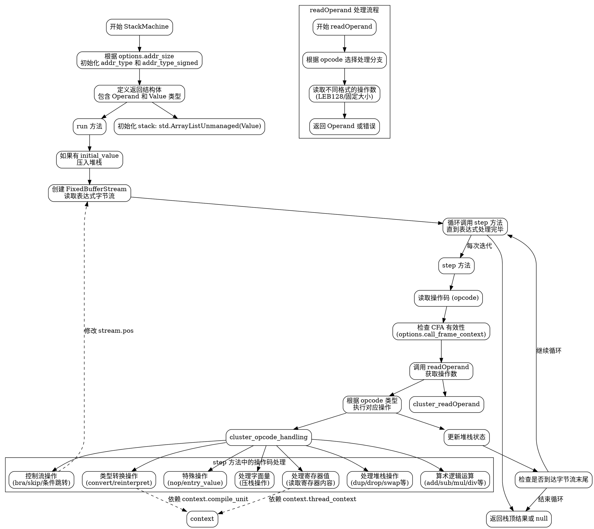

嗯，我需要为这个Zig函数生成一个流程图。首先，我应该理解这个函数的结构和逻辑。看起来这是一个StackMachine函数，返回一个结构体类型，包含多个方法，比如readOperand、run、step等。

首先，流程图应该从StackMachine的初始化开始，包括根据options.addr_size确定addr_type和addr_type_signed。然后，结构体中的各种操作，比如Operand和Value的定义。

接下来是readOperand函数，处理不同的操作码（opcode），生成对应的操作数。这里有很多switch case，处理不同的指令，比如OP.addr、OP.const1u等。每个case对应不同的读取方式和操作数类型。

然后是run方法，初始化堆栈，处理表达式，直到step返回false。step方法负责读取操作码和操作数，执行相应的操作，比如压栈、弹栈、算术运算、控制流操作等。

在画流程图时，需要注意各个方法之间的调用关系，特别是step中的各种操作码处理分支。可能的结构是主流程从run开始，调用step循环执行每个操作码，直到表达式处理完毕。

需要确定每个主要步骤的决策点和循环结构。比如，step函数中读取操作码后，根据不同的opcode进入不同的处理分支，每个分支执行不同的堆栈操作或计算。

还要注意错误处理，比如遇到不支持的opcode时返回错误，或者堆栈操作失败时的错误处理路径。

可能的结构图应该包括：

1. StackMachine的初始化，确定addr_type。
2. readOperand处理不同opcode，生成操作数。
3. run方法初始化堆栈，循环调用step。
4. step方法读取opcode和操作数，根据opcode类型执行相应操作。
5. 各操作码对应的处理逻辑，比如算术运算、控制流、类型转换等。

需要注意的是，由于代码复杂，流程图可能需要分层次，先展示主流程，再细化每个主要函数或操作码的处理分支。

可能用到的图形元素包括开始/结束节点、处理步骤、条件判断（菱形）、子流程（比如readOperand的不同case）、循环结构（step循环执行直到表达式处理完毕）。

确保流程图清晰展示函数的主要逻辑路径，尤其是step函数中的多分支处理，以及各操作码如何影响堆栈状态和程序流程。
================================================
