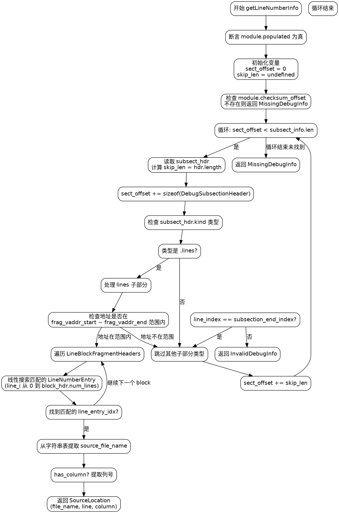

好的，我需要为给定的Zig函数绘制流程图。首先，我需要仔细阅读并理解这段代码的功能和结构。这个函数名为getLineNumberInfo，看起来是用来从PDB（程序数据库）文件中获取源代码位置信息的。

首先，函数开始于一些断言和变量初始化。然后进入一个循环，遍历subsect_info的各个子部分。每个子部分都有一个头部信息，根据不同的类型进行处理。这里主要处理的是.lines类型的子部分，其他类型则跳过。

在处理.lines子部分时，代码会检查给定的地址是否在该子部分的虚拟地址范围内。如果是，就会进一步处理其中的行块片段头，寻找匹配的行号条目。这里有一个线性搜索来找到最后一个起始地址小于或等于目标地址的行条目。找到后，会提取文件名、行号和列号，并返回这些信息。

需要注意循环的终止条件，以及在处理过程中可能出现的错误情况，如MissingDebugInfo和InvalidDebugInfo。此外，代码中有多个指针操作和内存偏移计算，需要确保这些操作的正确性，避免越界访问。

绘制流程图时，应该从函数入口开始，按顺序描述各个步骤，包括循环、条件判断、错误处理以及返回路径。每个主要操作块（如循环、条件分支、错误返回）都需要用相应的图形表示，并用箭头连接流程。

可能会有多个分支，特别是当处理不同的子部分类型时，只有.lines类型会被处理，其他类型会被忽略。在处理.lines时，内部还有多个嵌套的循环和条件判断，需要清晰地展示这些结构。

最后，确保流程图涵盖所有可能的执行路径，包括正常返回和错误返回的情况。同时，注意循环的退出条件和变量的更新步骤，如sect_offset和skip_len的更新。
================================================
