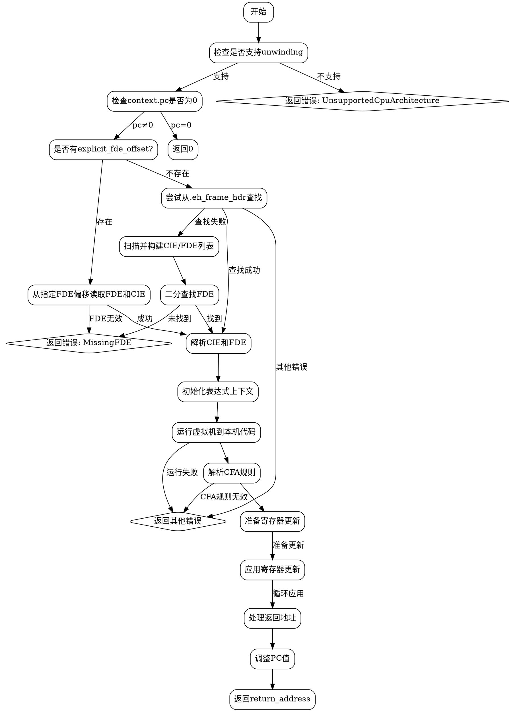

嗯，我需要为这个Zig函数`unwindFrameDwarf`画一个流程图。首先，我得仔细阅读代码，理解每个步骤的逻辑流程。这个函数看起来是用来处理DWARF展开帧的，可能是在调试或异常处理中用到的。

首先，函数开始检查是否支持unwinding，如果不支持就返回错误。然后检查context.pc是否为0，如果是的话直接返回0。接下来根据是否有`explicit_fde_offset`分成两个分支：如果有的话，直接从指定的FDE偏移读取FDE和CIE；如果没有的话，尝试从`.eh_frame_hdr`查找，如果失败则回退到扫描整个CIE和FDE信息，并进行二分查找。

之后，处理表达式上下文，运行虚拟机到本机代码，解析CFA（规范帧地址）规则，更新寄存器的值，处理返回地址，最后调整PC值并返回。

我需要将这些逻辑步骤转化为流程图中的节点和判断分支。需要注意的是条件判断，比如if语句和错误处理，以及循环结构，比如最后的while循环更新寄存器。同时，不同的分支路径需要正确连接，例如当`explicit_fde_offset`存在时的处理流程，和不存在时的不同处理方式。

可能的结构包括开始节点、条件判断节点（如是否支持unwinding、是否有explicit_fde_offset）、处理不同分支的步骤、错误处理节点、循环节点（如更新寄存器时的while循环），以及最终的返回节点。

需要确保每个可能的执行路径都被覆盖，包括错误返回的情况。例如，当查找FDE失败时返回error.MissingFDE，或者解析CIE时出现错误的情况。同时，还要注意各个步骤之间的数据流，比如如何获取FDE和CIE，如何运行虚拟机，如何解析CFA规则等。

可能遇到的挑战是正确表示嵌套的条件判断和错误处理，尤其是在处理`.eh_frame_hdr`时的异常捕获和回退机制。此外，循环结构如`while (update_tail)`需要正确体现在流程图中。

最后，流程图需要符合Graphviz的语法，使用正确的节点和箭头连接，确保逻辑清晰，结构合理。
================================================
