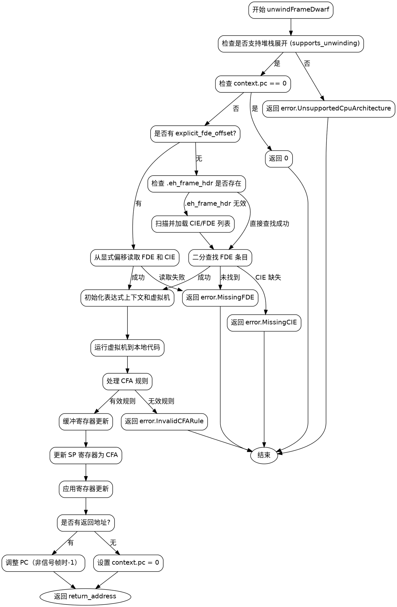

好的，我需要为这个Zig函数`unwindFrameDwarf`绘制流程图。首先，我得理解这个函数的结构和逻辑流程。这个函数的主要功能是展开堆栈帧，涉及处理DWARF调试信息，找到FDE和CIE，执行虚拟机的操作，更新寄存器上下文等。

首先，函数开始检查是否支持堆栈展开，如果不支持则返回错误。然后检查上下文中的PC是否为0，如果是则返回0。接下来，根据是否有显式的FDE偏移，分为两个分支来处理获取CIE和FDE。如果有显式偏移，直接从指定位置读取；否则，尝试使用.eh_frame_hdr，如果失败则回退到扫描并加载整个FDE列表。找到FDE后，通过二分查找定位到具体的条目。

然后，初始化表达式上下文和虚拟机，运行虚拟机到本地代码，处理CFA（规范帧地址）规则，可能是基于寄存器偏移或表达式计算。接着，处理寄存器的更新，使用Arena分配器来管理临时的更新操作，最后更新PC和返回地址，考虑信号帧的特殊情况。

在绘制流程图时，需要将这些步骤分解为不同的节点，包括条件判断、循环、错误处理等。可能的节点包括：

1. 检查是否支持展开。
2. 检查PC是否为0。
3. 分支处理显式FDE偏移或动态查找。
4. 读取FDE和CIE。
5. 处理.eh_frame_hdr失败的情况。
6. 二分查找FDE。
7. 初始化表达式上下文和虚拟机。
8. 运行虚拟机，处理CFA规则。
9. 处理寄存器更新。
10. 更新PC和返回地址。
11. 返回结果。

需要注意错误处理路径，例如返回error.MissingFDE、error.InvalidCFARule等。循环部分在更新寄存器时可能存在，但代码中使用了尾指针遍历链表，可能用循环结构表示。

可能的分支条件包括explicit_fde_offset是否存在，.eh_frame_hdr是否可用，是否找到FDE，CFA规则的类型，是否有返回地址等。

最后，生成Graphviz的DOT格式代码，用节点和边连接各个步骤，确保逻辑清晰，错误路径和正常流程都得到体现。
================================================
