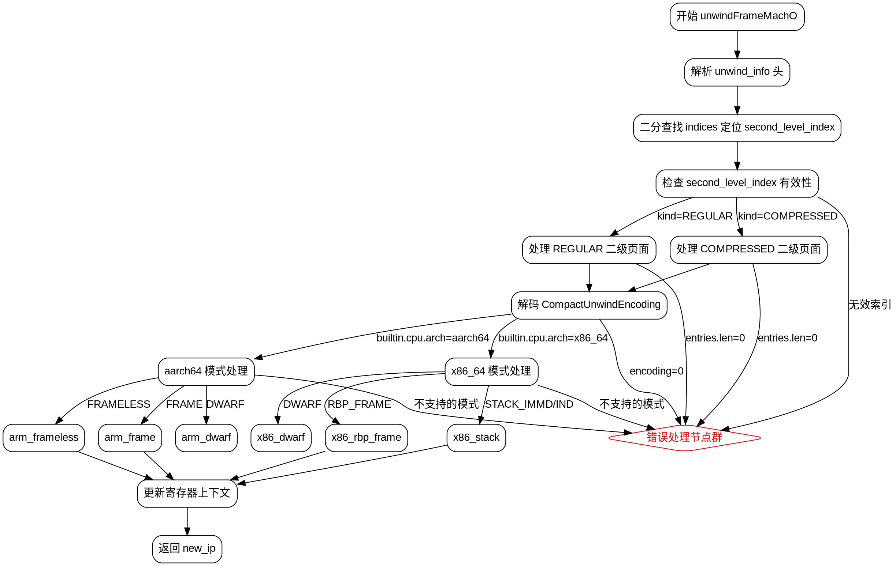

好的，我需要为给定的Zig函数`unwindFrameMachO`绘制一个流程图。首先，我需要理解这个函数的结构和逻辑流程。

函数开始于参数声明，然后处理unwind信息头，接着进行二分查找来定位正确的索引。根据找到的索引，处理不同的二级页面类型（REGULAR和COMPRESSED），解码编码信息，然后根据不同的CPU架构（如x86_64、aarch64）处理不同的展开模式（如RBP_FRAME、STACK_IMMD等）。最后，更新上下文中的寄存器值并返回新的指令指针。

接下来，我需要将这一过程分解为流程图的主要步骤：

1. **函数入口**：处理参数和头信息。
2. **二分查找索引**：定位正确的second_level_index。
3. **处理二级页面类型**：分为REGULAR和COMPRESSED两种情况。
4. **解码编码信息**：根据不同的编码模式进行处理。
5. **架构特定处理**：x86_64和ARM的不同展开逻辑。
6. **更新上下文和返回**：设置新的寄存器值并返回new_ip。

需要注意的是，流程中存在多个错误检查（如返回error.MissingUnwindInfo），以及条件分支（如switch语句）。这些都需要在流程图中体现出来。

可能遇到的挑战是处理复杂的条件分支和嵌套的switch结构。需要确保每个条件分支都有清晰的路径，并且不同架构的处理逻辑分开表示。

最后，使用Graphviz的DOT语言将这些步骤和分支可视化，使用不同的节点和箭头表示流程走向，同时用菱形节点表示条件判断。
================================================
