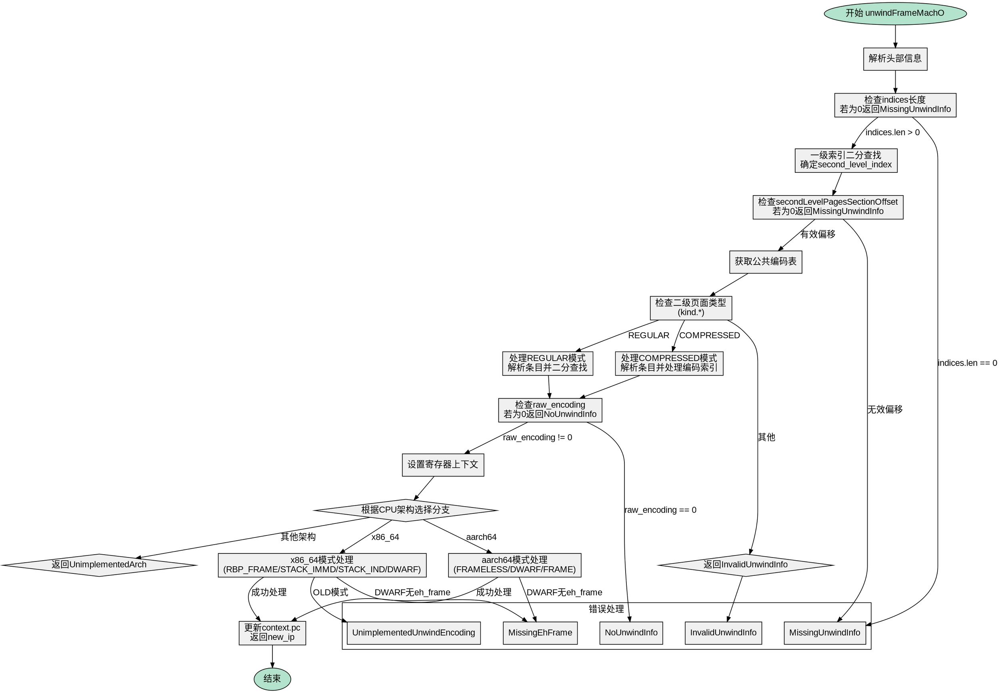

好的，我需要为给定的Zig函数`unwindFrameMachO`绘制一个流程图。首先，我需要理解这个函数的结构和逻辑流程。

函数的主要目的是处理Mach-O格式的栈展开信息。它接收多个参数，包括分配器、基地址、上下文、内存访问器等，并返回一个地址。函数内部首先解析头部信息，然后进行二进制搜索找到对应的二级索引。接着处理不同的编码模式（REGULAR和COMPRESSED），根据不同的架构（x86_64、aarch64等）执行不同的展开逻辑，最后更新上下文中的寄存器值和程序计数器。

接下来，我需要将这个过程分解成流程图的基本步骤。流程图的开始是函数入口，然后依次处理各个步骤，包括解析头部、搜索索引、处理二级页面、解码编码、处理不同架构的逻辑，最后返回结果。需要注意条件分支，例如不同的编码模式（REGULAR vs COMPRESSED）、不同的CPU架构（x86_64 vs aarch64）以及不同的展开模式（如FRAMELESS、DWARF等）。

在绘制流程图时，需要确保每个判断节点（如switch语句）都有明确的分支，并且每个处理步骤清晰。可能还需要处理错误情况，如返回error.MissingUnwindInfo等。

需要注意的是，函数中有多个嵌套的switch和if条件，需要正确表示这些逻辑分支。同时，某些部分涉及循环（如二进制搜索），这些循环在流程图中应表示为条件判断和循环结构。

最后，确保流程图的结构层次分明，每个步骤之间的连接正确，没有遗漏重要的逻辑路径。
================================================
