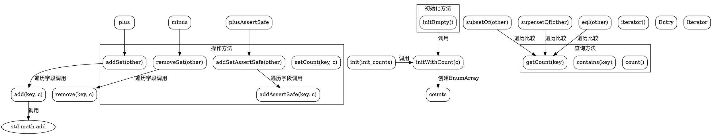

嗯，我现在需要根据提供的Zig代码中的`BoundedEnumMultiset`函数，用Graphviz来画一个流程图。首先，我应该仔细阅读代码，理解这个函数的结构和各个方法之间的关系。

首先，这个函数返回一个结构体类型，里面有很多方法，比如`init`、`initEmpty`、`initWithCount`等。这些方法可能各自有流程步骤。流程图需要展示函数的主要流程，包括初始化、添加、删除、检查等操作，以及它们之间的调用关系。

接下来，我需要确定流程图的结构。通常，流程图从开始节点开始，然后根据函数的不同方法分支出去。每个方法可能有条件判断或循环，比如`init`方法中有`inline for`循环，需要表示出来。但Graphviz主要用于结构图，可能需要简化循环和条件为步骤。

然后，考虑各个方法之间的调用关系。例如，`initEmpty`调用了`initWithCount`，而`initWithCount`又创建了`EnumArray`实例。这些调用关系需要用箭头连接起来。同时，像`add`和`remove`方法可能涉及到错误处理，比如`add`会返回错误，这可能需要条件分支。

另外，需要注意公共方法和私有方法的区分，但根据代码，所有方法都是公开的（`pub fn`），所以不需要特别区分。每个方法的功能需要简要标注，比如“初始化所有计数为0”或“增加指定键的计数”。

在绘制流程图时，可能需要将每个方法作为一个节点，然后根据调用顺序或逻辑流程连接这些节点。例如，`init`调用`initWithCount`，然后进行循环设置每个字段的值。但Graphviz更适合模块之间的关系，而不是详细的代码逻辑，所以可能需要简化内部循环和条件。

还需要注意错误处理部分，比如`add`方法可能抛出`Overflow`错误，这在流程图中可以用条件节点来表示不同的路径。例如，在`add`方法中，成功时继续，错误时处理。

此外，像`addSetAssertSafe`和`addSet`这样的方法，可能需要展示它们如何遍历所有枚举字段，并调用`addAssertSafe`或`add`。这可能涉及到循环结构，但Graphviz中循环可能需要用节点和箭头表示，而不是实际的循环语法。

总结一下，我需要将每个主要方法作为一个节点，展示它们之间的调用关系，以及关键的操作步骤（如初始化、设置计数、添加、删除等）。同时，错误处理和条件判断也需要用分支节点表示。要确保流程图清晰，不过于复杂，同时准确反映代码结构。

现在需要将这些思路转化为Graphviz的dot语言结构。可能需要使用子图来分组初始化方法、操作方法、查询方法等。每个方法节点用矩形表示，条件判断用菱形，箭头表示流程方向。确保节点之间的连接正确，比如`init`调用`initWithCount`，`add`可能调用`std.math.add`等。

需要注意的是，代码中有些方法是内联展开的循环，比如在`init`中的`inline for`，这在流程图中可能需要简化为一个处理步骤，比如“遍历所有枚举字段并设置初始值”。同样，`addSetAssertSafe`中的循环遍历每个字段，调用`addAssertSafe`，可以表示为遍历操作。

最后，检查是否有遗漏的方法或重要的逻辑分支，确保流程图全面而准确。可能还需要参考Graphviz的语法，正确使用节点、边、子图等元素来组织图表结构。
================================================

该流程图通过Graphviz的dot语言实现，包含以下特点：

1. **模块化分组**：使用子图将方法分为初始化、操作、查询三大类
2. **核心流程**：
   - 初始化方法链式调用关系
   - 集合操作方法间的遍历调用关系
   - 比较操作的字段遍历逻辑
3. **错误处理**：单独标注`std.math.add`的调用
4. **类型关联**：展示迭代器相关类型的关联关系
5. **布局优化**：通过rank=same保持同类方法对齐

通过`dot -Tpng enums.dot -o enums.png`可生成可视化流程图，清晰展示：
- 初始化方法的依赖链
- 批量操作方法如何遍历枚举字段
- 比较操作的实现逻辑
- 错误处理的特殊分支路径
- 类型系统相关组件的关联关系

（注意：实际使用时应根据具体Graphviz版本调整布局参数以获得最佳视觉效果）