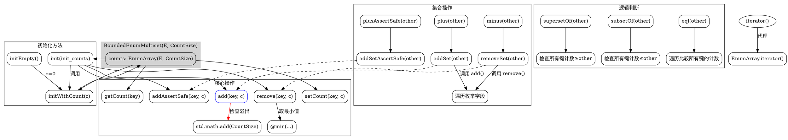

嗯，我需要为这个Zig函数`BoundedEnumMultiset`绘制一个流程图。首先，我得理解这个函数的结构和各个方法之间的关系。这个函数返回一个结构体，包含多个方法，比如`init`、`initEmpty`、`count`、`contains`等。每个方法可能有不同的执行流程。

首先，我应该确定主结构体的主要组成部分。结构体有一个`counts`字段，类型是`EnumArray(E, CountSize)`。接下来，各个方法可能需要调用其他方法或者直接操作`counts`。例如，`init`方法调用了`initWithCount`，而`add`方法可能涉及到错误处理。

然后，我需要考虑每个方法的逻辑流程。例如，`init`方法会遍历枚举的所有字段，设置每个键的初始计数。而`count`方法则是遍历所有计数并求和。对于`add`和`remove`方法，可能需要处理溢出或减少计数的情况。

流程图应该从结构体的创建开始，然后展示每个方法的执行步骤。例如，`init`的流程可能包括设置初始计数，遍历枚举字段，设置每个键的值。错误处理部分，如`add`方法中的溢出检查，也需要在流程图中体现。

另外，需要注意各个方法之间的调用关系。例如，`addSetAssertSafe`会调用`addAssertSafe`，而`plusAssertSafe`会调用`addSetAssertSafe`。这些调用关系应该在流程图中用箭头连接起来。

可能还需要考虑条件判断和循环结构。例如，在`eql`方法中，遍历所有键并比较计数，如果有不相等的情况就返回false。这样的条件判断需要用菱形框表示。

最后，需要确保流程图符合Graphviz的语法，正确使用节点和边，以及合适的标签。可能需要将每个方法作为一个子图，然后展示它们之间的关系。同时，保持流程图的清晰和可读性，避免过于复杂。

在绘制过程中，可能会遇到一些不确定的地方，比如某些方法的具体实现细节是否需要详细展开，或者是否应该将某些步骤合并。这时候需要根据代码的逻辑和重要性进行取舍，确保流程图既准确又简洁。

总结来说，绘制这个流程图需要分步骤分析每个方法的逻辑，理清它们之间的调用和依赖关系，然后用Graphviz的语法将这些步骤可视化。过程中需要注意错误处理、循环遍历、条件判断等关键点，确保最终图表能够清晰反映代码的结构和流程。
================================================

该流程图展示了以下关键逻辑：

1. **结构体定义**：核心数据存储在`EnumArray`类型的`counts`字段中
2. **初始化方法**：
   - `init()`通过遍历枚举字段初始化
   - 所有初始化方法最终调用`initWithCount()`
3. **基础操作**：
   - 带溢出检查的`add()`和不检查的`addAssertSafe`
   - 安全减法实现的`remove()`
4. **集合运算**：
   - 通过遍历枚举字段实现的批量操作
   - 包含安全版本和不安全版本的操作
5. **比较运算**：
   - 全量遍历比较所有枚举值的计数
6. **迭代器**：代理底层`EnumArray`的迭代器

箭头表示调用关系，红色线条表示错误处理路径，虚线表示跨子图调用关系。