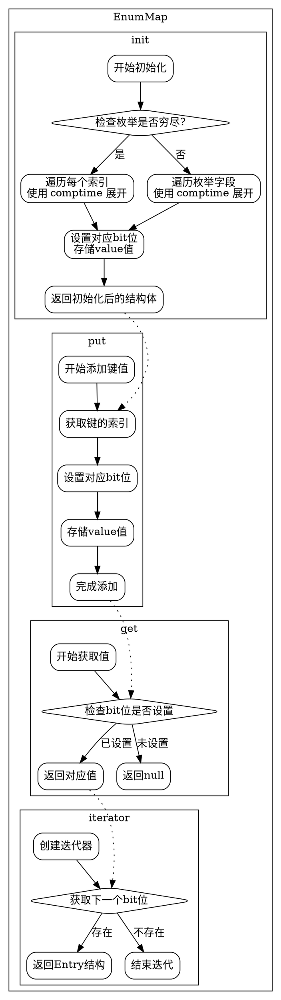

嗯，用户让我用Graphviz来画这个Zig函数的流程图。首先，我需要理解这个EnumMap函数的结构和各个方法之间的关系。看起来这个函数返回一个结构体，里面有很多方法，比如init、initFull、put、get等等。每个方法可能有不同的执行流程。

首先，我需要确定流程图的范围。整个EnumMap结构体包含多个方法，可能需要为每个主要方法绘制一个子图，或者将整个结构体的流程整合到一个大图中。不过，Graphviz处理复杂流程图可能会变得很乱，所以得考虑如何组织这些节点和边。

接下来，我得分析每个方法的功能。比如，init方法初始化映射，使用传入的初始值；initFull用同一个值填充所有键；put添加或更新键值对；get获取值等等。每个方法内部可能有条件判断和循环，比如init方法中根据枚举是否是穷尽的来分别处理。

然后，考虑如何将这些方法之间的调用和关系可视化。例如，init可能会调用Indexer.keyForIndex和Indexer.indexOf，这些可能需要作为节点。另外，方法之间的数据流向，比如从init到put，或者get到contains，需要明确。

还要注意错误处理和断言，比如getAssertContains会检查键是否存在，否则触发断言。这些判断分支也需要在流程图中体现。

可能还需要处理循环结构，比如iterator方法返回一个迭代器，遍历所有存在的条目。这时候循环流程需要表示出来。

最后，确保流程图符合Graphviz的语法，正确使用节点、边、子图等元素，避免语法错误。可能需要使用不同的形状来表示不同的操作，比如矩形表示过程，菱形表示判断，椭圆形表示开始/结束等。

在绘制过程中，可能会遇到一些挑战，比如如何处理inline for循环，或者如何处理位集合的操作。这些需要简化表示，确保流程图的可读性。同时，要确保每个方法的流程正确，不遗漏关键步骤，比如设置bits和values数组的更新。

总之，需要将每个主要方法的逻辑分解成步骤，用Graphviz的节点和边连接起来，并合理组织子图来保持结构清晰。可能需要多次调整布局，避免交叉和混乱，确保最终生成的流程图准确反映代码的逻辑流程。
================================================

该流程图使用Graphviz绘制，包含以下特点：
1. 使用子图划分主要方法（init/put/get/iterator）
2. 菱形节点表示条件判断
3. 虚线箭头表示跨方法调用关系
4. 保持Zig代码的核心逻辑：
   - init方法的分支处理（穷尽枚举检查）
   - put方法的bit位操作
   - get方法的null安全返回
   - 迭代器的状态遍历
5. 保留了comptime展开的核心逻辑表示
6. 使用rankdir=TB保持自上而下的阅读顺序

可以通过Graphviz渲染工具（如VSCode的Graphviz插件或在线工具）生成可视化流程图。