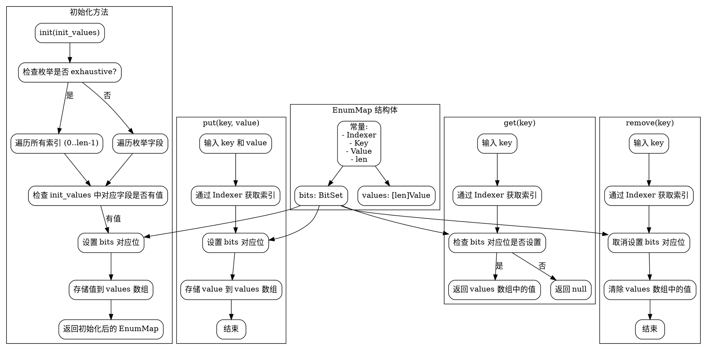

嗯，我现在需要为这个Zig语言中的EnumMap函数画一个流程图。首先，我需要理解这段代码的结构和各个函数的作用。看起来EnumMap是一个泛型类型，接受两个类型参数E和V，然后返回一个结构体。这个结构体应该是一个枚举到值的映射容器。

首先，我应该先看一下结构体的各个部分。结构体里有Indexer，Key，Value，len这些常量定义。然后有一个BitSet和一个values数组。BitSet可能用来记录哪些键存在，values数组存储对应的值。

接下来看init函数，它接受一个初始化值，可能是一个结构体，里面每个字段对应枚举的可能值，并用可选类型来表示是否有值。这里分两种情况处理，如果枚举是穷举的（exhaustive），就遍历所有可能的索引；否则，遍历枚举的字段。这里可能涉及到编译时的元编程，因为用了inline for和comptime。

然后是initFull，initFullWith，initFullWithDefault这些初始化函数，它们可能用来创建一个全量的映射，所有键都有值。这些函数设置bits为全满，并用给定的值填充values数组。

接下来是各种方法，比如count，contains，get，getAssertContains等，这些方法用于查询和操作映射中的键值对。还有put，putUninitialized，fetchPut，remove，fetchRemove等方法，用于修改映射内容。

最后是迭代器相关的结构体Entry和Iterator，允许遍历映射中的条目。

为了画流程图，我需要确定每个函数的执行流程，以及它们之间的调用关系。可能需要从初始化开始，然后展示如何添加、删除、获取元素，以及迭代器的使用。

但是流程图通常是针对单个函数的执行流程，而这个EnumMap是一个结构体的多个方法。可能需要分别对每个主要方法画流程图，或者对整个结构体的使用流程进行概括。

或者，可能需要从用户的角度出发，画出使用EnumMap的典型流程：初始化、添加元素、查询元素、删除元素、遍历元素等步骤，每个步骤对应不同的方法调用。

不过用户要求的是“函数的流程图”，而这里整个文件是一个函数EnumMap，返回一个结构体类型。所以可能需要把整个结构体的各个方法和它们之间的关系用流程图表示出来。

另外，注意到结构体中的方法之间有依赖关系，比如init方法调用了Indexer.indexOf和Indexer.keyForIndex，而Indexer是结构体内部定义的。可能需要将Indexer的作用也纳入流程图中，或者简化表示。

可能流程图的结构可以分为几个部分：

1. 结构体定义：包括常量、BitSet、values数组。
2. 初始化方法：init、initFull、initFullWith等。
3. 操作方法：put、remove、get等。
4. 迭代器部分。

每个方法的内部流程需要拆解。例如，init函数中，遍历字段，设置bits和values。可能需要用条件判断是否枚举是exhaustive，然后分别处理。

对于每个方法，比如get，流程可能是：输入key，转换成index，检查bits是否设置，返回对应的值或null。

不过要画所有方法的详细流程图可能会很复杂。可能需要简化，只展示主要流程，如初始化、添加元素、获取元素、删除元素的基本步骤，以及它们如何与bits和values数组交互。

或者，使用子流程的方式，每个方法作为一个子流程，主流程展示它们的调用顺序和关系。

可能需要先画出结构体的组成部分，然后每个方法作为一个节点，展示它们如何操作结构体的数据。

另外，BitSet的使用是关键，因为它跟踪哪些键存在。所以bits的设置和检查是很多方法的核心步骤。

可能的流程图步骤：

开始 -> 初始化EnumMap（调用init或initFull） -> 操作（put、remove等） -> 结束。

每个操作内部的具体步骤需要细化。例如，put操作的流程：

1. 输入key和value。
2. 使用Indexer.indexOf获取索引。
3. 设置bits的对应位。
4. 将value存入values数组的对应位置。

类似的，get操作：

1. 输入key。
2. 转换为索引。
3. 检查bits是否设置。
4. 是则返回对应值，否则返回null。

对于初始化函数init，流程可能更复杂：

1. 检查枚举是否exhaustive。
2. 遍历所有可能的键（根据是否exhaustive选择不同的遍历方式）。
3. 对每个键，检查初始化结构体中是否有值。
4. 如果有，设置bits的对应位，并存储值到values数组。

这样的流程图可能需要多个判断和循环节点。

不过由于这是用Graphviz画图，需要用文本描述节点和连接。可能需要将每个函数的主要步骤分解为节点，并用箭头连接。

例如，对于init函数：

节点1: 开始初始化
节点2: 检查枚举是否exhaustive
条件分支：是或否
如果exhaustive，节点3: 遍历所有索引0到len-1
否则，节点4: 遍历枚举的字段
然后对于每个键，节点5: 检查初始化结构体是否有值
如果有，节点6: 设置bits，存储值
最后节点7: 返回初始化后的EnumMap实例

这样的流程可以用Graphviz的条件节点和循环表示。

同样，其他方法如put、get等也需要类似的分解。

但考虑到所有方法的流程图可能过于庞大，可能需要简化，只展示主要方法和它们的关系，或者选择一个代表性的方法作为示例。

不过用户提供的整个代码是一个复杂的结构体，包含多个方法。可能需要分块处理，先画出结构体的组成部分，然后各个方法之间的调用和数据流动。

总结来说，流程图的绘制需要：

1. 结构体的组成部分（bits和values数组）。
2. 初始化流程。
3. 添加/修改元素的流程。
4. 查询元素的流程。
5. 删除元素的流程。
6. 迭代器的流程。

每个部分作为一个子图，展示其内部步骤和决策点。

现在，我需要将这些步骤转化为Graphviz的DOT语言描述。可能需要使用子图、节点和边来表示各个步骤。
================================================

这个流程图展示了以下内容：

1. **EnumMap 结构体**的核心组成部分（BitSet 和 values 数组）
2. **初始化方法**的分支逻辑（根据枚举是否 exhaustive 进行不同遍历）
3. **put 方法**的线性流程
4. **get 方法**的条件判断流程
5. **remove 方法**的清理流程

各个方法通过 BitSet 和 values 数组与结构体核心组件交互，用虚线箭头表示这种依赖关系。每个子图展示了对应方法的关键步骤和决策点。