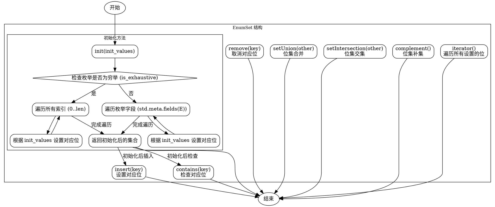

嗯，用户让我用Graphviz来画这个Zig函数EnumSet的流程图。首先，我需要理解这个函数的结构和逻辑。这个函数看起来是一个泛型类型，用于创建枚举类型的集合，使用位集来高效存储和操作枚举值。

首先，我应该确定这个函数的主要部分。函数返回一个结构体，里面有很多方法，比如init、insert、remove等等。每个方法可能有不同的流程。不过用户可能想要整个EnumSet结构的流程图，或者只是某个特定方法的流程图？可能需要澄清，但根据上下文，用户可能希望整个类型的主要流程。

接下来，我需要考虑如何将代码结构转换为流程图。流程图通常包括开始、结束、处理步骤、判断节点等。对于像init这样的方法，可能有不同的分支，比如是否是穷举枚举（exhaustive enum），这会影响初始化过程。此外，其他方法如insert、remove等可能相对简单，直接操作位集。

不过，Graphviz的流程图如果包含所有方法可能会很复杂。可能需要选择主要的方法或整体结构来绘制。或者，用户可能希望有一个高层次的结构图，显示各个方法之间的关系，以及它们如何与BitSet交互。

另外，需要注意代码中的条件语句，例如在init方法中的if (@typeInfo(E).@"enum".is_exhaustive)分支。这些条件应该在流程图中体现为判断节点，分别处理不同情况。

还需要考虑如何表示结构体的组成部分，比如内部类型Indexer、BitSet，以及各个方法的调用关系。或者，可能更关注控制流程，而不是数据结构的关系。

可能还需要确定流程图的详细程度。是每个函数一个子图，还是整体结构？例如，init方法的流程，contains方法的流程等，作为不同的子图，然后组合在一起。

此外，代码中的注释也需要参考，因为它们解释了每个方法的功能，这对绘制准确的流程图很有帮助。例如，initMany方法通过多次调用insert来初始化集合，这应该在流程图中体现为一个循环。

最后，生成Graphviz的DOT代码时，需要正确使用节点、边、条件分支等元素。可能还需要使用子图来组织不同的方法或结构体部分。

总结一下，步骤可能包括：

1. 分析代码结构，确定主要组件和方法。
2. 确定流程图的详细程度和范围。
3. 为每个主要方法绘制子流程图，特别是包含条件分支的方法。
4. 将各个子流程图整合到主流程图中，显示它们之间的关系。
5. 使用Graphviz语法编写DOT代码，确保节点和边的正确连接。

可能需要先画出init方法的流程图，因为它有较多的逻辑分支，然后处理其他方法如insert、remove等。对于每个方法，识别其步骤和可能的条件分支，转换为相应的流程图元素。

例如，init方法的流程：

- 开始
- 检查枚举是否是穷举的
- 如果是，遍历所有可能的索引，根据初始值设置位
- 如果不是，遍历枚举字段，设置对应的位
- 返回初始化后的集合

这需要判断节点和循环结构。

对于其他方法，如insert，流程简单：获取索引，设置位。可以表示为单一流程节点。

最终，整个EnumSet的流程图可能由多个子图组成，每个子图对应一个方法的主要流程，以及它们如何与BitSet交互。
================================================

该流程图展示了以下内容：

1. **初始化流程**（核心逻辑）：
   - 根据枚举是否穷举选择不同的初始化路径
   - 包含循环遍历索引或枚举字段的逻辑

2. **基本操作**：
   - `insert`/`remove`/`contains` 的简单位操作

3. **集合运算**：
   - 并集/交集/补集等位级操作

4. **迭代器**：
   - 遍历所有已设置位的机制

箭头方向表示方法间的逻辑顺序，菱形节点表示条件判断。每个操作最终都指向结束节点，表示它们都是独立的原子操作。初始化流程作为核心逻辑被详细展开，其他常用操作以简化的方式展示。