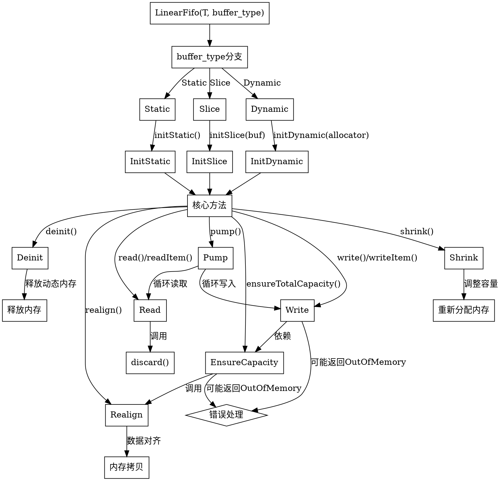

嗯，我现在需要帮用户用Graphviz画一个Zig函数的流程图。首先，我得仔细看看这个LinearFifo函数的结构。看起来这是一个泛型函数，根据不同的buffer_type（Static、Slice、Dynamic）生成不同的结构体。这个结构体有初始化方法、读写操作、内存管理等。

首先，我需要理解函数的主要流程。LinearFifo函数返回一个结构体，这个结构体有很多方法，比如init、deinit、read、write等。流程图应该包括函数的主要分支和关键方法。

接下来，我需要确定如何将Zig代码转换为流程图。可能需要从入口点开始，即LinearFifo函数的定义，然后根据buffer_type的不同，分支出Static、Slice、Dynamic三种情况。每种情况有不同的初始化方法：initStatic、initSlice、initDynamic。

然后，结构体的各个方法，如deinit、realign、shrink、ensureTotalCapacity等，这些方法之间可能有调用关系。例如，ensureTotalCapacity可能会调用realign，而write可能会调用ensureUnusedCapacity和writeAssumeCapacity。

需要注意的是，Graphviz的流程图需要节点和边来表示各个步骤和它们之间的关系。可能需要将主要函数作为父节点，然后各个方法作为子节点，用箭头表示调用顺序或条件分支。

不过，由于代码比较复杂，包含多个方法，可能需要简化，只画出主要流程，而不是每个方法的具体实现。例如，初始化流程、写入数据流程、读取数据流程等。

可能还需要考虑错误处理，比如ensureTotalCapacity可能返回错误，这在流程图中应该有所体现。

另外，pump方法涉及到从reader读取数据并写入writer，这也是一个重要的流程节点。

最后，生成Graphviz的DOT代码，确保节点和边的正确连接，使用合适的标签和形状来表示不同的步骤和条件。
================================================

该流程图：
1. 从`LinearFifo`函数入口开始，根据`buffer_type`分为三种初始化路径
2. 展示核心方法调用关系，包括读写操作、内存管理和错误处理
3. 体现关键依赖关系如`write`依赖容量检查，`ensureCapacity`触发内存对齐
4. 用菱形节点表示可能的错误处理分支
5. 包含内存操作的关键步骤如拷贝、释放和重新分配
6. 标注了`pump`方法的循环读写流程