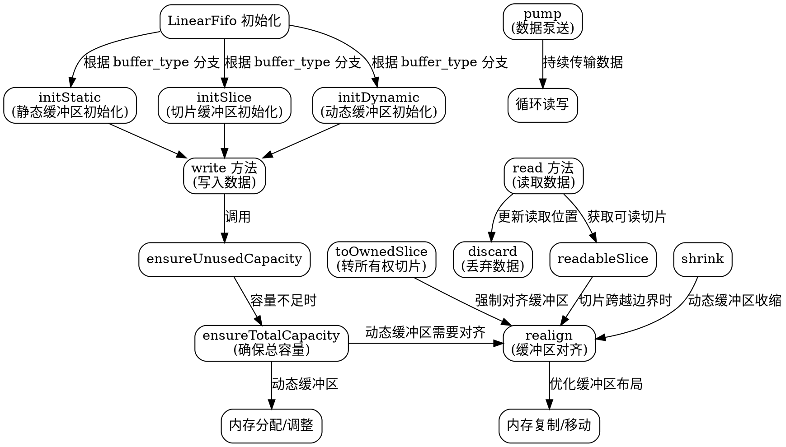

嗯，我需要为这个Zig语言编写的LinearFifo函数生成一个流程图。首先，我得理解这个函数的结构和各个部分的功能。看起来这是一个泛型结构体，根据不同的buffer_type（Static、Slice、Dynamic）有不同的初始化方法。然后有各种方法，比如读写、对齐缓冲区、调整容量等等。

首先，我应该先确定流程图的范围。整个函数返回的是一个结构体类型，里面包含了很多方法。流程图可能需要涵盖这个结构体的主要方法，比如初始化、读写操作、缓冲区管理（如realign、shrink、ensureTotalCapacity）等。

然后，我需要考虑如何将这些方法组织成流程。可能从初始化开始，根据不同的buffer_type分支。接着是写入和读取数据的过程，以及在这些过程中可能触发的缓冲区调整和对齐操作。还有像discard、peekItem、pump这些方法也需要被包括进去。

不过，问题是如何用Graphviz来表示这些流程。可能需要将每个方法作为一个节点，并用箭头表示它们之间的调用关系或执行顺序。另外，有些方法之间有条件判断，比如在realign中根据缓冲区的情况执行不同的内存复制操作，这些条件分支也需要在流程图中体现出来。

不过，考虑到代码的复杂度，可能无法详细画出所有方法的内部逻辑，而是以结构体的方法作为主要节点，展示它们之间的关系和主要的控制流。例如，初始化后，写入数据可能需要确保有足够的容量，若不够则调整缓冲区大小，然后写入数据，更新计数等。

另外，需要注意一些关键的方法，如ensureUnusedCapacity会调用ensureTotalCapacity，而后者在Dynamic类型下会重新分配内存。还有realign方法在写入或读取时可能会被调用以优化缓冲区的位置。

可能还需要区分不同buffer_type下的不同行为，比如Static类型下缓冲区大小固定，而Dynamic类型可以动态调整。这些差异应该在流程图中有所体现。

总结一下，我需要将LinearFifo结构体的主要方法及其调用关系用Graphviz的节点和边表示出来，包括初始化、读写操作、缓冲区调整、对齐等关键步骤，并标注不同buffer_type下的不同处理逻辑。同时，注意条件判断和循环结构，比如在read和write方法中的循环处理数据。

现在，我需要将这些思考转化为Graphviz的代码，使用合适的节点形状和箭头类型来表示不同的操作和流程。可能需要使用子图来分组不同的功能模块，例如初始化、写入、读取、缓冲区管理等。另外，使用注释或标签来说明各个步骤的条件和操作。
================================================

这个流程图通过以下方式表示逻辑：

1. **初始化分支**：根据`buffer_type`的不同（Static/Slice/Dynamic）选择对应的初始化方法
2. **核心写入流程**：
   - 写入时先检查可用容量（`ensureUnusedCapacity`）
   - 容量不足时触发扩容（`ensureTotalCapacity`）
   - 动态缓冲区需要内存重分配和对齐操作
3. **核心读取流程**：
   - 通过`readableSlice`获取可读数据
   - 读取后调用`discard`更新缓冲区状态
   - 切片跨越缓冲区边界时触发`realign`
4. **缓冲区管理**：
   - `realign`操作涉及内存复制优化布局
   - 动态缓冲区的收缩（`shrink`）需要对齐操作
5. **高级功能**：
   - `pump`方法实现持续的读写循环
   - `toOwnedSlice`在转所有权时强制对齐缓冲区

不同形状的节点表示不同类型的操作（椭圆表示决策/分支，矩形表示具体方法），箭头上的标签说明调用关系或条件判断。