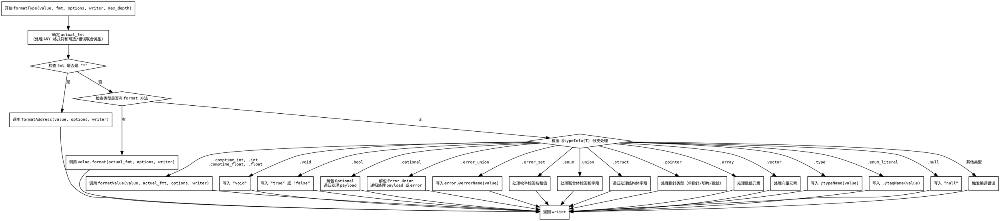

好的，我需要为给定的Zig函数`formatType`绘制一个流程图。首先，我需要理解这个函数的结构和逻辑流程。函数的主要作用是根据不同的类型格式化值，并写入到指定的writer中。流程图中需要涵盖各个条件分支和类型处理步骤。

首先，函数开始于接收参数`value`, `fmt`, `options`, `writer`, `max_depth`。然后确定实际的格式字符串`actual_fmt`，这里有几个条件判断，比如检查`fmt`是否是`ANY`，或者处理可选类型和错误联合类型的格式符。

接下来，函数检查是否有`"*"`格式，处理地址格式化。然后检查类型是否有`format`方法，如果有则调用该方法。

之后，根据`@typeInfo(T)`的结果进入不同的分支，处理各种类型，如整数、布尔、void、可选类型、错误联合、枚举、联合体、结构体、指针、数组、向量等。每个类型都有特定的处理逻辑，例如枚举类型可能需要输出标签名，结构体需要递归处理字段，指针可能有不同的子类型处理等。

需要考虑递归调用的情况，比如处理结构体字段时，会再次调用`formatType`，此时需要注意`max_depth`参数的控制，避免无限递归。此外，各个分支中可能涉及错误处理和格式验证，比如`invalidFmtError`。

绘制流程图时，应该从函数入口开始，逐步根据条件分支展开每个可能的处理路径。每个条件判断（如`if`语句和`switch`语句）都需要对应的判断框，然后根据不同的结果导向不同的处理步骤。对于递归调用，需要标明递归的入口和出口。

需要注意流程图的清晰性，避免过于复杂，可以适当将某些子流程（如结构体处理、指针处理等）作为子图或独立节点表示。同时，确保所有可能的类型分支都被覆盖，并且逻辑顺序正确。

最后，确认流程图是否符合Graphviz的语法，使用正确的节点和箭头连接，避免使用Mermaid语法。可能需要使用不同的形状（如矩形表示处理步骤，菱形表示判断）来区分不同类型的节点。
================================================
