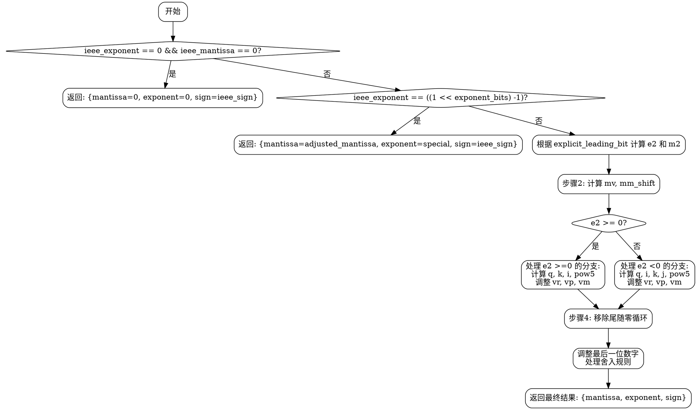

好的，我需要为提供的Zig函数`binaryToDecimal`绘制一个流程图。首先，我得理解这个函数的结构和逻辑流程。

函数的主要步骤看起来是处理IEEE二进制浮点数的各个部分（符号位、尾数、指数），然后根据不同的条件分支计算十进制表示的各个参数。函数中有多个条件判断，比如处理特殊情况（如指数全为0或全为1）、计算e2和m2的不同路径，以及后续的步骤2、3、4中的各种循环和条件处理。

首先，我应该确定函数的主要流程分支：

1. 检查指数和尾数是否为0，直接返回结果。
2. 检查指数是否全为1，处理无穷大或NaN的情况。
3. 根据是否显式前导位（explicit_leading_bit）计算e2和m2。
4. 步骤2确定区间。
5. 步骤3转换为十进制幂基。
6. 步骤4寻找最短十进制表示，包括循环处理移除尾随零和调整最后一位数字。
7. 返回最终结果。

接下来，我需要将这些步骤转化为流程图中的节点，并用箭头连接条件分支。例如，处理指数是否为0或全为1的分支，以及根据explicit_leading_bit的不同路径。

需要注意的是循环部分，比如在步骤4中的while循环，以及可能的后续循环处理vm的尾随零。此外，一些条件如vr_is_trailing_zeros和vm_is_trailing_zeros会影响流程。

可能的结构如下：

- 开始
- 检查指数和尾数是否为0 → 返回0情况
- 检查指数全为1 → 返回特殊值
- 计算e2和m2的分支（根据explicit_leading_bit）
- 步骤2：确定区间（计算mv, mm_shift等）
- 步骤3：根据e2正负分两个子路径处理十进制转换
- 步骤4：循环处理移除尾随零，调整数字
- 处理最后的尾随零和舍入
- 返回结果

需要确保每个条件判断都有两个分支（是/否），并且循环结构正确表示。可能使用菱形表示条件判断，矩形表示处理步骤，箭头标明流程方向。

此外，函数中的一些细节，比如变量定义和计算步骤，可能需要简化为流程图中的处理框，避免过于复杂。例如，计算bias、ieee_sign等可以合并到初始处理步骤中。

最后，确保流程图清晰展示函数的逻辑结构，便于理解各部分的执行顺序和条件分支。
================================================
