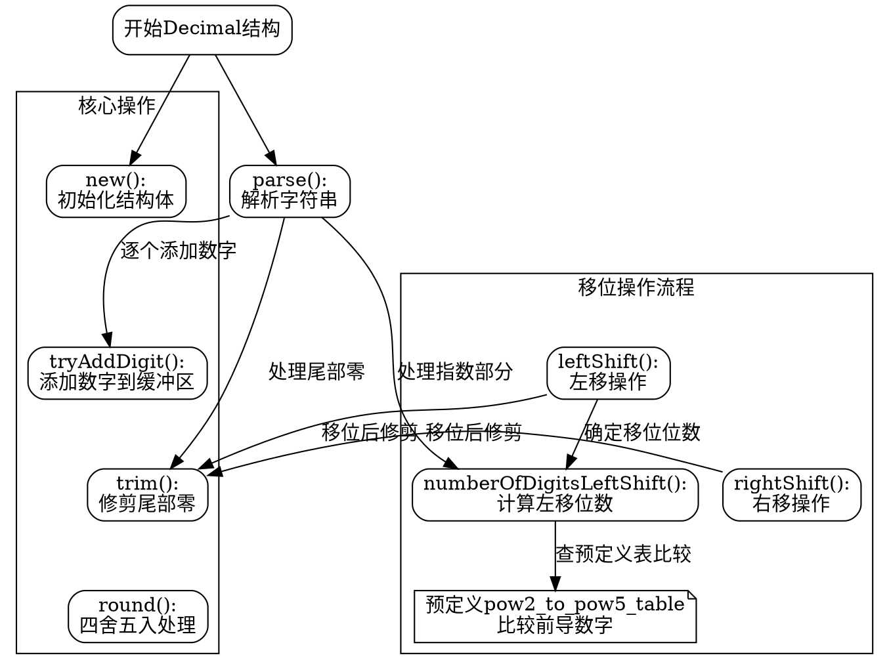

好的，我需要根据提供的Zig代码中的`Decimal`函数来绘制一个流程图。首先，我需要理解这个函数的结构和各个部分的功能。看起来这个函数定义了一个处理十进制数的结构体，包含了初始化、添加数字、修剪、移位等操作。

首先，我会确定主要的流程节点。函数`Decimal`返回一个结构体类型，这个结构体有多个方法和常量。我需要将这些方法作为流程图中的不同节点。比如`new`、`tryAddDigit`、`trim`、`round`、`leftShift`、`rightShift`、`parse`等。

接下来，考虑这些方法之间的调用关系。例如，`parse`方法会调用`tryAddDigit`来逐个添加数字，而`leftShift`和`rightShift`可能会调用`trim`来修剪尾部的零。此外，`round`方法在确定四舍五入时会检查数字是否被截断。

然后，我需要处理每个方法内部的逻辑流程。例如，在`parse`函数中，处理输入字符串，跳过前导零，处理小数点，处理指数部分等步骤。每个条件判断（如是否遇到小数点、指数符号）都会产生分支，需要在流程图中体现。

需要注意的是，`numberOfDigitsLeftShift`方法使用了预定义的`pow2_to_pow5_table`来确定左移后的数字位数变化。这里有一个循环比较当前数字和预设的截断值，这需要在流程图中展示循环和条件判断。

另外，错误处理和断言也是重要部分，比如`std.debug.assert`的使用，虽然在流程图中可能不需要详细表示，但可以作为一个节点提示关键检查点。

最后，整合所有节点和流程，确保每个方法的入口和出口正确连接，条件分支清晰，循环结构合理。使用Graphviz的语法来定义各个节点（矩形框表示过程，菱形表示判断），并用箭头连接它们，标注条件或操作说明。

可能遇到的挑战是如何简洁地表示复杂的逻辑，尤其是像`parse`和`numberOfDigitsLeftShift`中的循环和条件嵌套。需要合理拆分步骤，避免图表过于复杂。同时，确保所有重要的函数调用和数据处理步骤都被涵盖，不遗漏关键细节。
================================================
