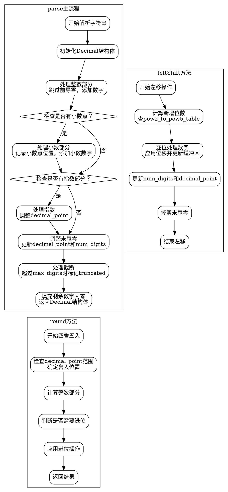

嗯，我现在需要为这个Zig语言写的Decimal函数画一个流程图。首先，我得先理解这个代码的结构和各个部分的功能。看起来这个Decimal函数是一个泛型结构体，根据不同的MantissaT类型（u64或u128）生成不同的配置。结构体里面有很多常量和方法，比如max_digits、parse、leftShift、rightShift、round等等。

首先，我需要确定主流程从哪里开始。可能从parse函数开始，因为这是解析输入字符串为Decimal结构的主要入口。parse函数会处理数字字符串，跳过前导零，处理小数点，处理指数部分，然后构建Decimal对象。

接下来，leftShift和rightShift方法处理十进制的位移运算，涉及到数字的移位和调整decimal_point的位置。round方法用于四舍五入，trim去掉末尾的零。numberOfDigitsLeftShift这个函数看起来是用来计算左移操作后新增的位数，这里用到了预先生成的pow2_to_pow5_table表来进行快速计算。

为了画流程图，我需要分步骤来：

1. **入口点**：可能是parse函数，处理输入字符串。
2. **初始化Decimal结构体**：设置num_digits、decimal_point、truncated和digits数组。
3. **处理整数部分**：跳过前导零，逐个添加数字。
4. **处理小数部分**：如果有小数点，继续处理小数部分，调整decimal_point。
5. **处理指数部分**：如果有'e'或'E'，处理指数，调整decimal_point。
6. **调整和修剪**：去掉末尾的零，处理截断情况。
7. **其他方法流程**：比如leftShift、rightShift、round等各自的方法流程。

对于每个方法，比如leftShift，需要画出其内部逻辑：计算新增位数，调整数字数组，处理进位或截断，更新num_digits和decimal_point，最后调用trim修剪。

不过，考虑到这是一个复杂的结构体，包含多个方法，可能需要分多个子流程图，或者用主流程图展示主要函数调用关系，然后为每个重要方法单独画子图。

在绘制时，需要注意条件判断（比如if语句）、循环（比如while循环处理数字）、函数调用（如trim、round）等结构。例如，parse函数中有多个循环处理数字，条件判断是否有小数点或指数部分。

另外，像numberOfDigitsLeftShift函数中使用了预先生成的表来比较当前数字和临界值，决定新增的位数，这部分需要画出查表和比较的过程。

可能的挑战是如何将所有这些方法整合到一个流程图中而不显得混乱。可能需要分层处理，先画顶层结构，再分解各个方法的内部流程。

总之，我需要先理清每个函数的作用和执行顺序，然后逐步用图形化的节点和箭头表示控制流和数据流，确保逻辑正确且易于理解。
================================================

该流程图包含三个主要部分：

1. **parse主流程**（绿色区域）：
- 从字符串解析开始，依次处理整数部分、小数点和指数
- 最终完成数字的规范化处理

2. **leftShift方法**（蓝色区域）：
- 展示二进制左移操作的核心流程
- 包含查表计算位移量和缓冲区更新机制

3. **round方法**（橙色区域）：
- 显示四舍五入的判断逻辑
- 包含边界条件检查和进位处理

各模块通过不可见边表示代码结构的层级关系，实际执行时通过方法调用连接。关键决策点用菱形节点表示，核心操作使用矩形节点，保持了算法逻辑的清晰可视性。