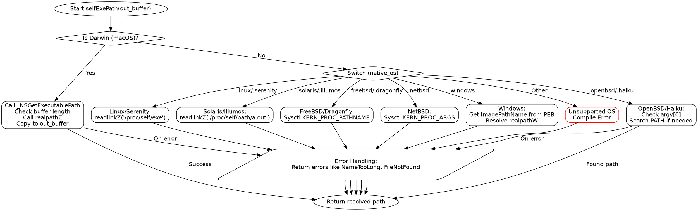

好的，我需要为给定的Zig函数`selfExePath`绘制流程图。首先，我需要理解这个函数的结构和逻辑流程。让我先仔细阅读代码。

这个函数的目标是获取当前执行文件的路径，处理不同操作系统的差异。函数首先检查是否是Darwin系统（如macOS），如果是，使用`_NSGetExecutablePath`获取路径，并通过`realpath`解析符号链接。然后，如果不是Darwin，它会根据不同的操作系统（如Linux、Solaris、FreeBSD等）选择不同的实现方式。每个操作系统分支有不同的系统调用或方法获取可执行文件路径。最后，对于Windows，使用PEB获取镜像路径，并进行处理。

接下来，我需要确定各个条件分支，并绘制出流程图的主要节点和判断点。例如：

1. 开始函数。
2. 判断是否是Darwin系统？
   - 是：调用`_NSGetExecutablePath`，然后处理路径，检查长度，复制到输出缓冲区。
   - 否：进入switch语句，根据不同的OS处理。
3. 对于每个OS分支（如Linux、Solaris、FreeBSD等），分别有不同的处理逻辑。
4. 处理Windows的特殊情况。
5. 其他未支持的系统触发编译错误。

需要注意各个分支中的错误处理，例如返回错误码或进行其他操作。另外，每个分支可能还有子条件，例如在OpenBSD中尝试通过argv[0]查找路径，或者搜索PATH环境变量。

在绘制流程图时，需要将这些条件判断和处理步骤用合适的图形表示，比如菱形表示判断，矩形表示处理步骤，箭头表示流程方向。同时，错误返回的路径也需要标明。

可能遇到的挑战是确保所有分支都被正确覆盖，尤其是各个操作系统特定的处理逻辑。需要仔细检查每个case，确保没有遗漏。此外，错误处理部分如`catch`语句也需要在流程图中体现。

总结步骤：
1. 确定函数入口。
2. 判断是否为Darwin，分两个主分支。
3. 非Darwin情况下，根据OS类型进一步分支。
4. 每个OS分支内部的处理逻辑和可能的子判断。
5. 错误处理和返回路径。
6. 最终返回结果或错误。

现在，我需要将这些步骤转化为Graphviz的DOT语言，使用合适的节点和连接线来表示流程。
================================================
