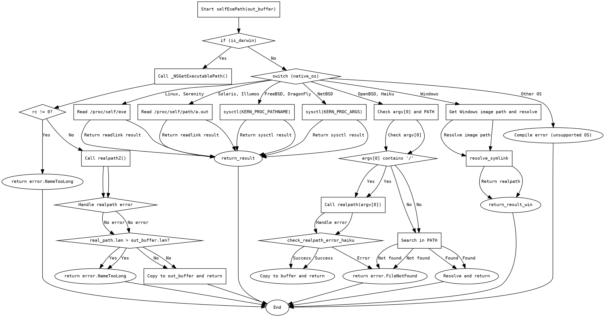

好的，我需要为这个Zig函数`selfExePath`生成一个Graphviz的流程图。首先，我要仔细阅读代码，理解它的结构和逻辑。

函数的主要目的是获取当前可执行文件的路径，针对不同的操作系统有不同的处理方式。代码中首先检查是否是Darwin系统，如果是，使用特定的系统调用获取路径，然后处理可能的错误。对于其他系统，如Linux、Solaris、FreeBSD等，分别有不同的处理分支。Windows部分也有独立的逻辑，而其他未支持的系统会触发编译错误。

接下来，我需要确定流程图的各个节点和分支。主流程应该从函数开始，然后根据不同的操作系统分支出不同的处理路径。每个分支内部可能还有条件判断和错误处理。例如，在Darwin分支中，先调用`_NSGetExecutablePath`，然后处理返回值和可能的错误，接着使用`realpathZ`获取真实路径，并检查缓冲区长度是否足够。

需要注意各个条件判断后的不同路径，比如错误返回、继续执行等。例如，在OpenBSD和Haiku的处理中，如果`argv[0]`包含路径分隔符，则直接使用`realpath`，否则搜索PATH环境变量中的路径。

此外，每个分支的结束点通常是返回结果或错误，需要将这些作为终止节点。同时，确保所有可能的错误情况都被覆盖，比如缓冲区不足、文件未找到等。

最后，将这些逻辑转化为Graphviz的节点和边，使用适当的形状（如矩形表示过程，菱形表示判断，椭圆形表示开始/结束）和箭头连接各个步骤。确保流程图的层次清晰，不同操作系统的分支明确分开，避免交叉混乱。

在绘制过程中，需要特别注意代码中的条件分支和错误处理，确保每个可能的执行路径都有对应的流程。例如，在Darwin部分，如果`_NSGetExecutablePath`返回错误，直接返回错误；否则继续处理。同样，在调用`realpathZ`时，捕获可能的错误并处理。

对于Windows部分，处理Unicode字符串并转换为路径，然后获取真实路径，这部分流程也需要详细展示。而最后的`else => @compileError`则是处理不支持的操作系统，这在流程图中应作为一个终止节点。

总结来说，流程图的结构应该以函数入口开始，根据不同的操作系统分支出不同的处理流程，每个流程内部处理各自的逻辑和错误，最终返回结果或错误。确保每个步骤和判断都有对应的节点，并用箭头正确连接，形成完整的执行路径。
================================================

将此Graphviz代码粘贴到支持.dot格式的工具（如Graphviz、VSCode的Graphviz插件等）中即可生成流程图。主要特点：

1. 使用菱形节点表示条件分支
2. 椭圆形节点表示错误返回和函数出口
3. 完整覆盖所有代码分支（Darwin、Linux、Windows等不同OS处理路径）
4. 包含错误处理逻辑（NameTooLong、FileNotFound等）
5. 保持了与Zig代码相同的控制流结构