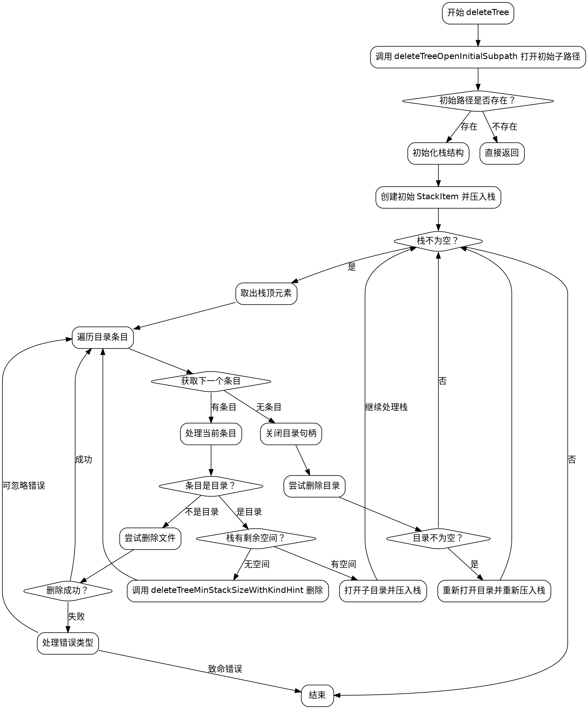

嗯，我需要为这个用Zig编写的deleteTree函数画一个流程图。首先，我得仔细读一遍代码，理解它的逻辑结构。这个函数的作用是递归删除目录树，对吧？看起来它使用了栈结构来处理目录的遍历，而不是递归，这样可以避免栈溢出的问题。

首先，函数开始时会调用deleteTreeOpenInitialSubpath来打开初始的子路径。如果返回的是null，就直接返回，说明没有需要删除的内容。否则，初始化一个栈结构，用来保存遍历的目录项。栈的每个元素包括目录名、父目录和迭代器。

接下来，进入主循环process_stack，只要栈不为空就继续处理。每次取出栈顶元素，然后遍历其中的条目。对于每个条目，判断是目录还是文件。如果是目录，尝试打开它，并将新的目录项压入栈中，继续处理。如果栈的容量不足，就调用deleteTreeMinStackSizeWithKindHint来处理。如果是文件，直接删除。

处理完一个目录的所有条目后，关闭目录句柄，并尝试删除该目录。如果目录不为空（DirNotEmpty错误），则需要重新打开目录，重新遍历，确保所有子项都被删除。这部分可能需要重试机制。

需要注意的是，在Windows系统上，删除目录前需要先关闭句柄，所以代码中有相应的处理。此外，错误处理部分需要特别关注，不同的错误类型会导致不同的处理路径。

画流程图的时候，应该从函数入口开始，分为几个主要步骤：初始化栈、处理栈中的每个目录、遍历目录条目、处理文件和子目录、关闭目录并尝试删除，处理可能的错误和重试情况。每个判断条件（如是否是目录、栈是否有空间、删除是否成功）都需要作为分支点。

可能需要使用不同的形状来表示不同的流程节点，比如矩形表示操作，菱形表示判断，箭头表示流程方向。还要注意循环和条件分支的结构，确保流程图的逻辑清晰，能够反映代码的执行路径。

不过，代码中有一些复杂的控制流，比如使用标签（如process_stack和handle_entry）和继续到特定标签的语句（如continue :process_stack）。这些需要在流程图中正确表达，可能需要使用子流程或者更复杂的结构来表示循环和条件跳转。

此外，错误处理部分有很多不同的错误类型，每个错误类型可能导致不同的处理方式。在流程图中，可能需要将这些错误条件作为分支来处理，或者简化为一个错误处理节点，具体取决于详细程度的要求。

总之，流程图的主要步骤包括：
1. 初始化栈结构。
2. 进入主循环，处理栈顶目录。
3. 遍历目录中的每个条目，处理文件和子目录。
4. 关闭目录并尝试删除。
5. 处理删除失败的情况，可能需要重新入栈重试。
6. 处理各种错误情况，返回相应的错误。

需要将这些步骤用图形化的方式表示出来，确保逻辑正确且易于理解。
================================================

该流程图的关键节点说明：
1. **栈结构管理**：使用栈实现非递归遍历，支持深度优先搜索
2. **目录/文件区分处理**：通过entry.kind判断类型，分别采用不同删除策略
3. **错误重试机制**：对DirNotEmpty错误采用重新打开目录的恢复策略
4. **资源管理**：严格遵循"打开-关闭"模式，特别处理Windows的文件句柄释放问题
5. **边界条件处理**：包含文件不存在、权限问题、路径过长等多种异常分支

流程图呈现了从初始路径检查到完整目录树删除的核心逻辑，着重表现了：栈操作循环、条目类型判断、错误处理三大核心模块的交互关系。