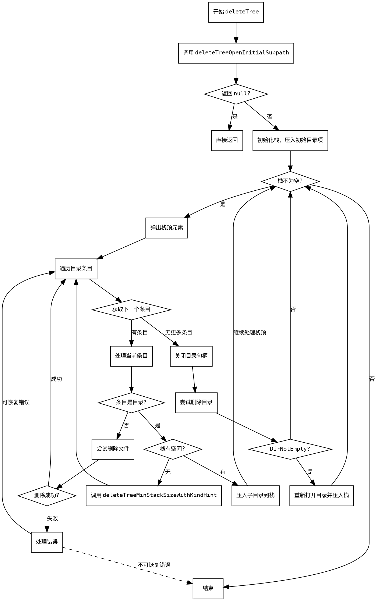

好的，我现在需要为给定的Zig函数`deleteTree`绘制一个流程图。首先，我得理解这个函数的工作原理。函数的作用是递归删除目录树，包括所有子目录和文件。看起来它使用了一个栈结构来处理目录遍历，可能采用深度优先的方式。

首先，函数开始时调用`deleteTreeOpenInitialSubpath`来打开初始的子路径。如果返回`null`，说明路径不存在，直接返回。否则，初始化一个栈结构`stack`，用于存储目录项的信息，包括名称、父目录和迭代器。

接下来，进入一个循环`process_stack`，处理栈中的每个目录项。对于每个条目，使用迭代器遍历其中的文件和子目录。当遇到目录时，会尝试将其添加到栈中继续处理，若栈空间不足，则调用`deleteTreeMinStackSizeWithKindHint`来删除该目录。如果是文件，则直接删除。处理完所有子项后，关闭目录句柄，然后尝试删除当前目录。如果目录不为空（`DirNotEmpty`错误），则需要重新打开目录并重新处理。

需要注意的是，在Windows系统上，删除目录前需要先关闭其句柄，因此代码中有相应的处理逻辑。此外，错误处理部分需要正确捕获并传递可能的错误。

接下来，绘制流程图时，应按照以下步骤进行：

1. **函数入口**：开始于`deleteTree`函数。
2. **打开初始子路径**：检查是否成功打开，失败则返回错误。
3. **初始化栈**：将初始目录项压入栈中。
4. **循环处理栈顶元素**：
   - 遍历当前目录的每个条目（文件或子目录）。
   - 对于子目录，尝试压入栈继续处理；若栈满则直接删除。
   - 对于文件，直接删除，处理可能的错误。
5. **关闭当前目录句柄**：特别是Windows系统需要此步骤。
6. **尝试删除当前目录**：如果失败且原因是目录非空，则重新处理。
7. **处理结束**：栈为空时结束流程。

需要注意条件判断，比如错误处理分支、栈空间是否足够、是否需要重新处理目录等。每个步骤之间的转换需要明确条件，例如成功删除后的流程，或者遇到错误时的返回路径。

可能遇到的困难是如何准确表示栈的操作和循环结构，尤其是在处理目录非空需要重新入栈的情况。需要确保流程图中能清晰展示循环和条件分支，尤其是`process_stack`循环内的多级条件判断。

最后，确保使用Graphviz的语法正确描述各个节点和边，避免使用Mermaid格式。节点用矩形表示步骤，菱形表示条件判断，箭头表示流程方向，并标注条件（如“是/否”或错误类型）。
================================================

此流程图使用Graphviz的DOT语言绘制，展示了以下关键流程：
1. 初始化目录迭代器
2. 基于栈的深度优先遍历
3. 文件和目录的不同处理逻辑
4. 错误处理机制
5. Windows特殊处理（关闭句柄后删除）
6. 目录非空时的重试逻辑

节点形状说明：
- 矩形：操作步骤
- 菱形：条件判断
- 虚线箭头：异常退出路径