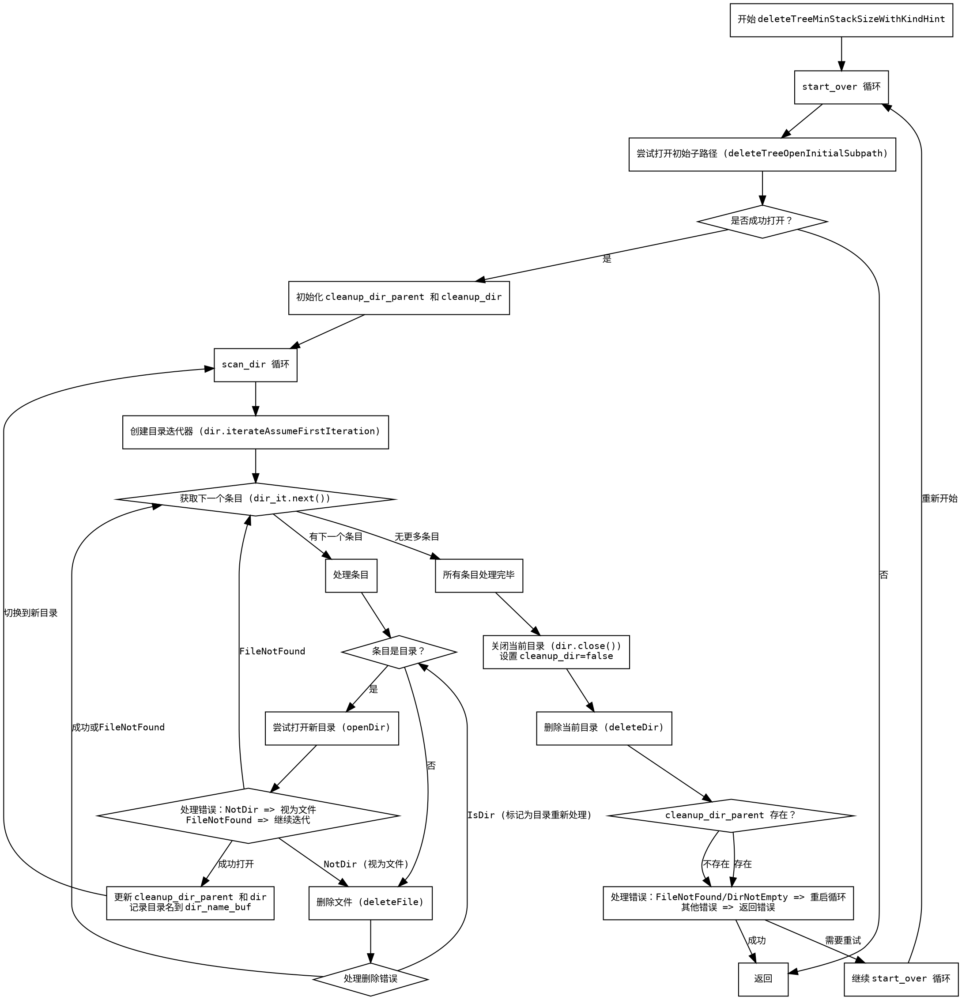

好的，我需要为给定的Zig函数`deleteTreeMinStackSizeWithKindHint`绘制流程图。首先，我需要理解这个函数的结构和逻辑流程。

函数的主要逻辑是删除指定路径下的所有文件和子目录，确保使用最小的栈空间，避免递归。函数使用循环和标签（如`start_over`、`scan_dir`、`dir_it`、`handle_entry`）来控制流程。

首先，函数进入`start_over`循环，尝试打开并处理初始子路径。如果无法打开，则直接返回。接着，处理目录中的每个条目：如果是文件，直接删除；如果是目录，则进入该目录继续处理。处理完所有条目后，删除当前目录本身，并处理可能的错误或重试情况。

接下来，我需要将这个过程分解成流程图中的各个步骤。可能的步骤包括：

1. 开始`start_over`循环。
2. 打开初始子路径，如果失败则返回。
3. 初始化清理目录的父目录。
4. 进入`scan_dir`循环，迭代目录条目。
5. 处理每个条目：
   - 如果是目录，打开并切换到新目录。
   - 如果是文件，删除文件。
6. 处理完所有条目后，关闭当前目录，删除目录本身。
7. 处理错误或重试的情况，可能需要回到`start_over`循环。

需要注意循环结构、错误处理以及可能的流程跳转。例如，当处理目录条目时，如果遇到需要切换到新目录的情况，流程会跳回`scan_dir`循环的开始。如果在删除目录时遇到错误，可能需要重新开始整个流程。

另外，需要正确表示条件判断、循环和错误处理分支。使用合适的图形元素，如菱形表示判断，矩形表示操作，箭头表示流程方向。

最后，确保流程图符合Graphviz的语法，正确使用节点和边的定义，避免语法错误。
================================================

这个流程图使用Graphviz的DOT语言绘制，完整展示了：
1. 主循环`start_over`的重试逻辑
2. 目录扫描`scan_dir`的嵌套循环结构
3. 文件/目录处理的决策分支
4. 错误处理路径
5. 目录切换时的状态更新
6. 资源清理操作（通过`defer`语句实现）

关键决策点用菱形表示，循环结构通过标签跳转实现，错误处理分支明确展示了不同错误类型的处理方式。箭头标签使用Zig代码中的实际错误判断条件，保持了与原始代码的高度对应。