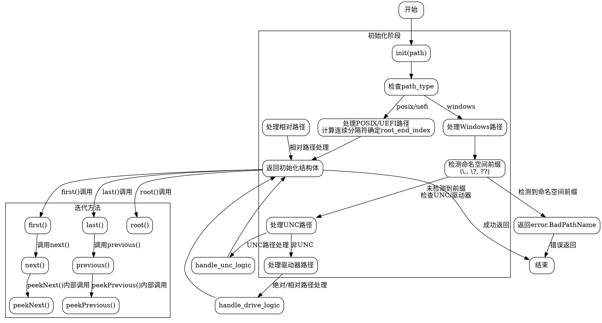

好的，我现在需要帮用户用Graphviz画出一个Zig函数的流程图。首先，我需要仔细阅读用户提供的代码，理解这个函数的结构和逻辑。这个函数是`ComponentIterator`，它根据不同的路径类型（POSIX、Windows、UEFI）来迭代路径的各个组件。

首先，我要确定这个函数的主要流程。函数`init`根据不同的`path_type`处理不同的路径格式。例如，对于POSIX和UEFI路径，处理根目录的方式是计算连续的路径分隔符。对于Windows路径，处理更复杂，包括命名空间前缀、UNC路径、驱动器路径等。

接下来，我需要考虑各个方法之间的调用关系，比如`init`之后调用`first`或`last`，然后使用`next`或`previous`来遍历组件。每个方法如`next`、`previous`、`peekNext`、`peekPrevious`都有各自的逻辑，可能会修改迭代器的状态或只是查看下一个/上一个组件。

为了画流程图，我需要将这些步骤分解成不同的节点，并用箭头表示流程的走向。例如，初始化（init）之后，用户可以选择调用`first`或者`last`，然后根据方向调用`next`或`previous`。每个方法内部的条件判断（如循环检查路径分隔符）也需要在流程图中体现出来。

需要注意的是，不同的路径类型（如Windows的UNC路径和驱动器路径）在初始化时有不同的处理逻辑，这些分支需要用条件判断节点来表示。同时，错误处理（如返回`error.BadPathName`）也需要在流程图中标注。

可能遇到的困难是如何将复杂的条件分支和循环结构清晰地用Graphviz表示出来。可能需要使用子图来分组不同的路径类型处理逻辑，或者使用注释节点来解释某些复杂步骤。此外，确保流程图的逻辑顺序正确，不会遗漏重要的步骤或条件。

另外，要确保不错误地使用Mermaid语法，用户特别指出要使用Graphviz。因此，我需要用DOT语言来编写流程图，正确使用节点、边、子图等元素，并合理布局以避免图形过于拥挤。

总结步骤：
1. 确定函数的主要入口点（init方法）。
2. 分解每个方法（init、root、first、last、next、previous等）的内部逻辑。
3. 根据条件分支（如path_type的不同）创建不同的流程分支。
4. 处理循环结构，如初始化中的while循环。
5. 将错误处理（如返回错误）整合到流程图中。
6. 使用Graphviz的语法结构将这些元素连接起来，形成完整的流程图。

在实现过程中，需要多次检查每个节点的连接是否正确，条件分支是否覆盖所有情况，以及整体结构是否清晰易懂。可能需要先画出草稿，再逐步优化布局，确保流程图的可读性。
================================================

该流程图使用Graphviz的DOT语言绘制，主要特点：

1. 垂直布局(rankdir=TB)，符合代码执行流程
2. 使用子图将初始化阶段和迭代方法分组
3. 详细展示Windows路径处理的特殊分支：
   - 命名空间前缀检测
   - UNC路径处理逻辑
   - 驱动器路径处理
4. 用不同颜色区块区分主要处理阶段
5. 箭头标注条件判断的走向
6. 包含错误处理流程(红色节点)
7. 展示了方法间的调用关系

可以通过Graphviz工具(如VSCode的Graphviz插件)渲染生成矢量图，关键路径：
1. 初始化阶段的类型分支
2. Windows路径的复杂验证逻辑
3. 迭代方法的双向遍历能力(next/previous)
4. peek方法与主方法的调用关系