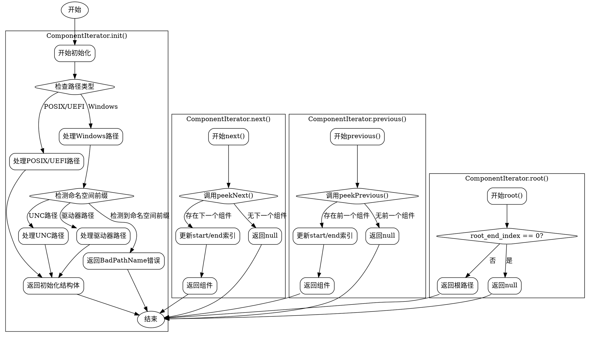

好的，我现在需要为提供的Zig代码中的`ComponentIterator`函数绘制流程图。首先，我需要理解这个函数的功能和结构。看起来这是一个用于处理不同路径类型（如POSIX、Windows、UEFI）的迭代器，用于分解路径的各个组件。

首先，我会从`init`函数开始分析。这个函数初始化迭代器，处理不同路径类型的根目录。对于POSIX和UEFI，根目录是连续的路径分隔符，而Windows需要处理驱动器、UNC路径等特殊情况。这里有一些错误检查，比如Windows的命名空间前缀不允许。接下来是`root`方法，返回根路径部分。

然后是`first`和`last`方法，分别用于获取路径的第一个和最后一个组件。`next`和`previous`方法用于遍历组件，而`peekNext`和`peekPrevious`则是查看而不改变状态。

在绘制流程图时，我需要考虑每个函数的流程，包括条件判断和循环。例如，`init`函数根据路径类型进行不同的处理，特别是Windows路径需要处理多种情况。这可能需要在流程图中用多个分支来表示。

对于每个方法，如`next`，流程可能包括移动索引、检查分隔符、截取组件名称和路径等步骤。需要注意循环处理连续的分隔符，并正确更新开始和结束索引。

在绘制过程中，可能会遇到复杂的分支结构，尤其是Windows路径的处理部分。需要确保每个条件分支都清晰表示，例如UNC路径、驱动器绝对路径等的处理。

另外，错误处理也是需要考虑的部分，比如Windows路径中的`BadPathName`错误，需要在流程图中体现出来。

最后，整个流程图的布局要合理，使用合适的图形元素（如矩形表示步骤，菱形表示判断，箭头表示流程方向），确保逻辑清晰，易于理解。
================================================
