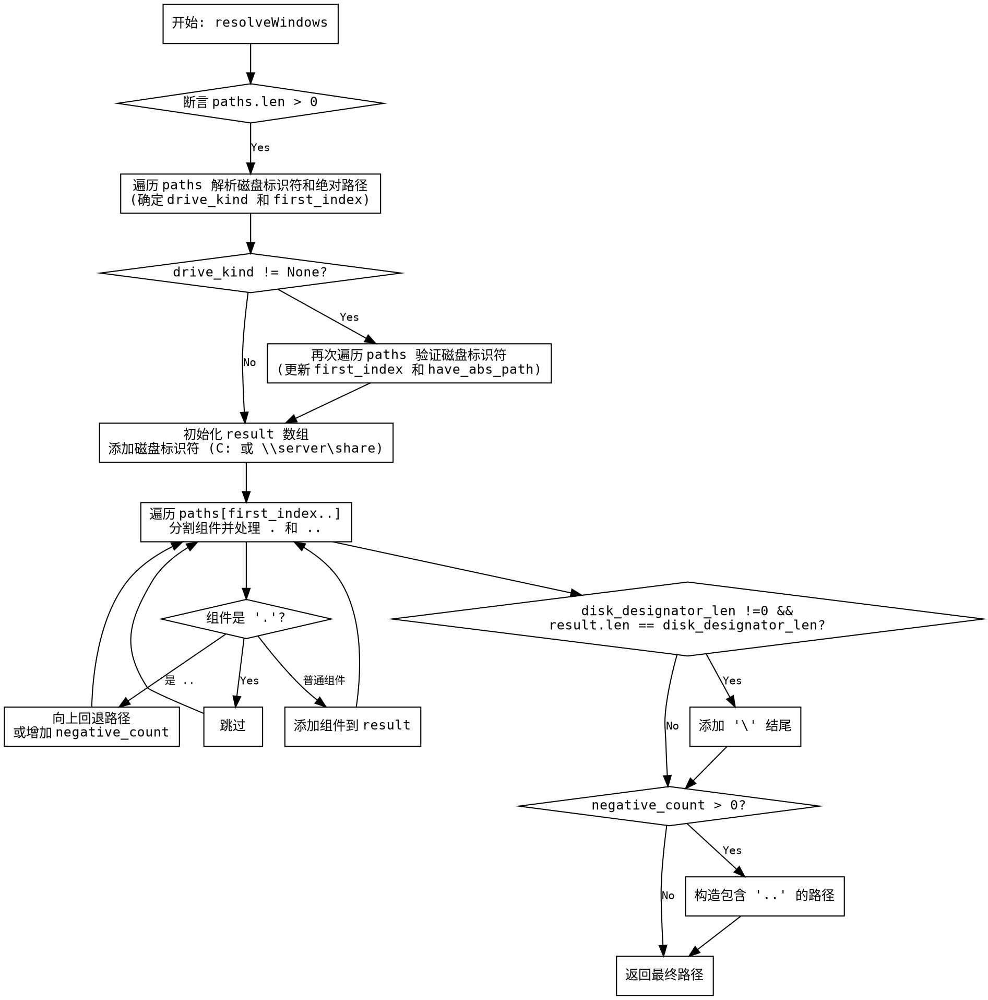

嗯，用户让我用Graphviz来画这个Zig函数的流程图。首先，我需要理解这个函数的功能。看起来这个函数是处理Windows路径解析的，可能类似于Node.js中的path.resolve，将多个路径片段合并成一个绝对路径。

首先，函数开始检查路径数组是否非空。然后处理磁盘标识符，比如C:或者网络路径\\server\share。接着，确定最终的磁盘标识符和类型。然后处理绝对路径，找到最后一个绝对路径作为起点。之后，构建结果路径，处理各种情况如.和..，以及相对路径的合并。最后处理可能的负计数，生成包含..的路径。

接下来，我需要将这个过程转化为流程图。流程图应该包括各个主要步骤和条件判断。比如：

1. 检查paths是否为空。
2. 遍历路径确定磁盘标识符和绝对路径。
3. 再次遍历确定正确的磁盘标识符和起始索引。
4. 初始化结果缓冲区，添加磁盘标识符。
5. 遍历处理每个路径片段，处理.和..。
6. 处理结果路径末尾的斜杠。
7. 处理可能的负计数（即需要返回上级目录的情况）。

需要注意循环和条件分支的结构，比如for循环遍历路径，if判断是否是绝对路径，switch处理不同的磁盘类型等。还要处理路径组件的迭代，使用tokenize分割路径，处理每个组件。

可能需要将每个主要步骤作为节点，用箭头连接，条件判断用菱形节点。例如：

- 开始节点：函数入口。
- 判断paths.len >0，否则断言失败。
- 第一个循环遍历paths，解析每个路径，确定磁盘类型和绝对路径。
- 判断磁盘类型是否为None，不是的话进入第二个循环，再次检查磁盘标识符。
- 初始化result数组，添加磁盘标识符。
- 处理每个路径组件，处理.和..。
- 判断是否需要在结果末尾添加斜杠。
- 处理negative_count，生成最终结果。

需要确保流程图的每个分支都覆盖到代码中的不同情况，比如网络路径和驱动器路径的不同处理，以及相对路径和绝对路径的组合。

可能还需要注意错误处理和内存分配，但用户主要关注控制流程，所以可能不需要详细画出allocator的处理，除非对流程有影响。

最后，用Graphviz的DOT语言将这些步骤结构化，使用正确的节点和边，条件判断用菱形，处理步骤用矩形，循环用适当的结构表示。
================================================
