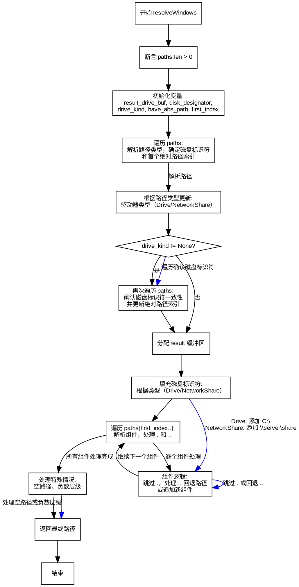

嗯，我需要为这个Zig函数`resolveWindows`绘制流程图。首先，我得仔细阅读代码，理解它的逻辑结构。函数的主要功能是解析Windows路径，处理驱动器标识符、网络共享路径，以及路径中的`.`和`..`组件。看起来函数分为几个部分：

1. **确定磁盘标识符**：遍历所有路径，找到绝对路径并确定驱动器类型（本地驱动器或网络共享）。
2. **处理磁盘标识符的绝对路径**：再次遍历路径，找到最后一个绝对路径的索引，并确保正确的磁盘标识符。
3. **分配和填充结果缓冲区**：根据磁盘标识符初始化结果路径，处理每个路径组件，处理`.`和`..`，构建最终路径。
4. **处理特殊情况**：比如路径为空或存在多个`..`的情况。

接下来，我需要将这些步骤转化为流程图。流程图应包括开始、结束节点、条件判断、循环和各个处理步骤。需要注意循环遍历路径的部分，以及条件判断如驱动器类型、绝对路径是否存在、组件是否为`.`或`..`等。

可能会遇到的难点是如何正确表示循环和条件分支，尤其是嵌套的部分。例如，第一个循环确定磁盘类型，第二个循环再次处理路径以找到正确的磁盘标识符，然后是处理各个路径组件的循环。每个循环内部又有条件判断，需要清晰地区分这些层次。

另外，需要注意错误处理和内存管理，比如使用`allocator`分配内存，`defer result.deinit()`确保释放资源。不过流程图可能不需要详细展示内存管理，而是聚焦在逻辑流程上。

最后，根据代码的结构，将各个步骤和判断用图形表示，确保流程图的逻辑正确且易于理解。
================================================

### 流程图说明：
1. **初始检查**：确保输入路径非空。
2. **首次遍历**：确定磁盘类型（本地驱动器/网络共享）和首个绝对路径位置。
3. **二次遍历**（仅当有磁盘标识符时）：确保路径使用一致的磁盘标识符。
4. **填充磁盘标识符**：根据类型添加 `C:\` 或 `\\server\share` 前缀。
5. **组件处理**：逐个处理路径组件，跳过`.`，处理`..`回退路径。
6. **特殊处理**：空路径时返回`.`，负数层级时构造`..\\..`等格式。
7. **返回结果**：最终拼接好的绝对路径。

图形使用标准流程图符号，菱形表示条件判断，矩形表示操作步骤，箭头表示流程方向。