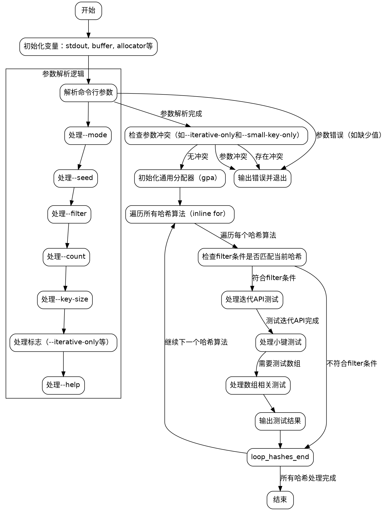

嗯，我需要为这个Zig函数画一个流程图。首先，我得仔细阅读代码，理解它的结构和逻辑流程。这个函数是main函数，处理命令行参数，配置一些选项，然后进行哈希性能测试。

首先，函数开始处定义了一些变量，比如stdout、buffer、allocator等。然后解析命令行参数，根据不同的参数设置不同的标志，比如filter、count、key_size等。这里有几个条件判断，比如处理--mode、--seed、--filter等参数。需要理清楚每个参数的处理流程，尤其是错误处理，比如参数不足时调用usage()并退出。

接下来，检查是否有冲突的参数组合，比如test_iterative_only和test_small_key_only同时存在时会报错。之后初始化内存分配器，然后进入主要的循环部分，遍历hashes数组，进行性能测试。

循环内部根据不同的条件调用不同的benchmark函数，比如benchmarkHash、benchmarkHashSmallKeys等，并输出结果。这里有一些条件判断，比如是否测试迭代API、是否测试小键等。同时，当test_arrays为true时，会测试数组相关的哈希函数。

需要注意的是，代码中有很多条件分支，特别是内联循环和条件判断。在画流程图时，需要将这些分支清晰地表示出来，比如参数解析部分的各种if-else，以及后续测试哈希函数时的不同情况。

可能的结构是：开始 -> 初始化变量 -> 解析参数 -> 检查参数冲突 -> 初始化分配器 -> 循环处理每个哈希函数 -> 根据条件执行不同的测试 -> 输出结果 -> 结束。

在处理每个哈希函数时，需要判断是否满足filter条件，然后根据不同的测试标志执行对应的测试分支。例如，如果test_iterative_only为真，则只测试迭代API；否则可能测试其他情况。

另外，代码中的inline for循环可能需要特别处理，因为它们在编译时展开，但流程图可能需要以运行时循环的结构来表示。

可能的挑战是处理复杂的条件嵌套，并确保所有分支都被正确表示。需要将每个条件判断（如参数处理、测试标志检查）作为流程图中的决策节点，然后根据结果分支出不同的处理路径。

最后，确保流程图的逻辑顺序正确，包括错误处理路径（如参数错误时退出）和正常执行路径。可能需要使用不同的形状来表示开始/结束节点、处理步骤、决策节点等。
================================================

该流程图的关键路径说明：
1. 从初始化变量开始，进入命令行参数解析
2. 参数解析包含嵌套条件分支（如--mode/--seed等特殊参数处理）
3. 检查参数冲突后进入内存分配器初始化
4. 主循环遍历所有哈希算法，通过filter筛选后执行三种测试模式：
   - 迭代API测试
   - 小键模式测试
   - 数组模式测试（需额外条件触发）
5. 每个测试分支结束后汇总结果输出
6. 错误处理路径直接指向终止节点

特殊形状说明：
- 菱形节点表示条件判断
- 虚线框表示参数解析的子过程
- 不可见边用于保持子图对齐