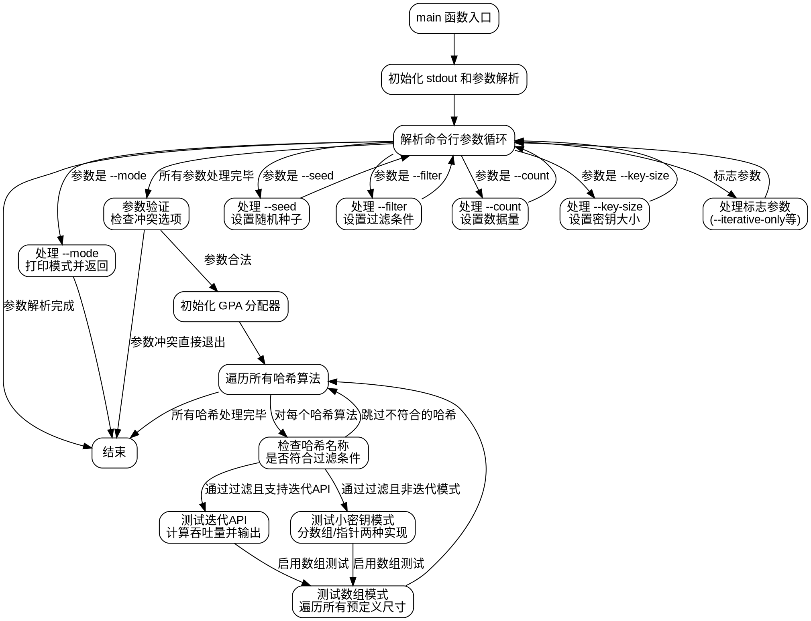

好的，我需要为提供的Zig代码生成一个流程图。首先，我得仔细阅读代码，理解它的结构和逻辑流程。

代码从定义main函数开始，处理命令行参数，设置各种测试选项，然后根据这些选项执行不同的基准测试。主要的步骤包括：

1. 初始化标准输出和参数解析。
2. 处理命令行参数，设置过滤条件、计数、密钥大小、种子等。
3. 参数验证，如检查是否同时使用了互斥的选项。
4. 使用通用分配器初始化内存。
5. 遍历所有哈希算法，根据过滤条件选择是否运行测试。
6. 根据不同的测试模式（迭代、小密钥、数组等）执行对应的基准测试，并输出结果。

接下来，我需要将这些步骤转化为Graphviz的流程图。流程图应该包括开始节点、处理参数、条件判断（如参数解析中的各种if-else）、循环结构（遍历哈希算法），以及各个测试分支。

需要注意的是，Zig代码中的inline for循环和条件编译可能需要特别处理。不过，在流程图中，可以简化为循环和条件判断节点。此外，错误处理和退出点也需要在流程图中体现。

可能的结构如下：

- 开始节点：main函数入口。
- 初始化stdout和参数解析。
- 进入参数解析循环，处理每个参数，设置相应的变量。
- 参数验证，检查冲突选项。
- 初始化内存分配器。
- 遍历哈希算法，检查过滤条件。
- 根据测试模式执行不同的基准测试，输出结果。
- 结束节点。

需要注意各个条件分支的走向，例如处理--mode参数时直接返回，其他参数处理后的继续循环，以及错误情况下的退出流程。

最后，确保流程图中的节点和箭头正确反映了代码的执行顺序和逻辑分支，避免遗漏重要的步骤或条件。
================================================
