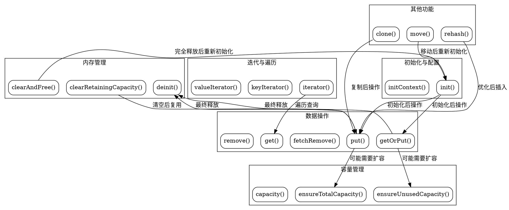

嗯，我需要用Graphviz来绘制这个Zig函数的流程图。首先，我得理解这个函数的结构。看起来这是一个泛型函数，用于创建HashMap的结构体类型。函数返回一个包含各种方法和属性的结构体。

首先，这个结构体有几个成员：unmanaged、allocator和ctx。其中，unmanaged是另一个类型HashMapUnmanaged的实例。然后，定义了很多公共常量和方法，比如Entry、KV、Hash等类型别名，以及init、initContext、lockPointers、unlockPointers、deinit等方法。

我需要把这些方法按照调用顺序或逻辑关系组织起来。不过，流程图通常展示的是函数内部的执行流程，而这个函数实际上是返回一个结构体类型，所以可能更侧重于结构体的方法调用流程。

可能需要分步骤来画：

1. 初始化和配置：包括init和initContext方法，用于创建HashMap实例。
2. 内存管理：如deinit、clearRetainingCapacity、clearAndFree，处理资源的释放。
3. 数据操作：put、getOrPut、fetchRemove等方法，涉及数据的增删改查。
4. 迭代和查询：iterator、keyIterator、valueIterator，用于遍历数据。
5. 容量管理：ensureTotalCapacity、ensureUnusedCapacity、capacity，处理内存预分配。
6. 其他功能：clone、move、rehash等，提供复制、移动和重新哈希的功能。

每个方法之间可能有调用关系，比如deinit会调用unmanaged的deinit方法。但流程图可能需要更直观地展示主流程，比如从初始化开始，到各种操作，再到资源释放。

不过，由于这是一个结构体的方法集合，而不是单一函数的执行流程，可能需要将每个方法作为独立的节点，并根据它们的调用关系连接起来。例如，init调用后可能调用put，put可能调用ensureCapacity等。

或者，可以按照功能的模块来分组，比如初始化、内存管理、数据操作等，用子图表示。

另外，需要注意一些方法之间的依赖关系，比如getOrPut可能会触发内存分配，从而调用ensureUnusedCapacity。

不过，可能用户希望看到的是整个结构体的方法调用流程，而不仅仅是单个函数的内部流程。因此，可能需要将每个方法作为一个节点，并展示它们之间的关系。

或者，如果用户希望的是这个HashMap类型的使用流程，比如从初始化到添加元素到释放的整个过程，那么流程图会更线性。

可能需要进一步明确用户的需求，但根据问题描述，用户希望的是“函数的流程图”，而这个函数实际上是返回一个结构体类型，包含多个方法。因此，可能需要绘制该结构体各方法之间的调用关系或执行流程。

或者，用户可能希望将整个结构体的方法组织成一个流程图，展示各个方法如何协同工作。

总之，可能需要将各个方法作为节点，并根据它们的功能和调用关系进行连接。例如：

- init → put → get → remove → deinit
- ensureCapacity 被 put 调用
- iterator 依赖于当前数据状态

同时，可能需要注意条件分支，比如getOrPut在存在键时的处理与不存在时的处理不同。

不过，由于Graphviz的流程图是静态的，可能更适合展示结构而非动态流程。因此，可能更倾向于展示结构体的组成和各方法的分组。

或者，可以按照主要功能模块来组织流程图，比如：

1. 初始化模块：init, initContext
2. 内存管理：deinit, clearRetainingCapacity, clearAndFree
3. 数据操作：put, get, remove, fetchPut
4. 容量管理：ensureTotalCapacity, ensureUnusedCapacity, capacity
5. 迭代器：iterator, keyIterator, valueIterator
6. 其他：clone, move, rehash

每个模块内部的方法可以放在同一个子图中，模块之间用箭头表示可能的调用顺序或依赖关系。

可能还需要考虑错误处理，比如一些方法返回Allocator.Error，但流程图中可能难以详细展示。

综上所述，我需要设计一个分模块的流程图，展示HashMap结构体的主要方法及其分组，可能用子图表示各个功能模块，并用箭头表示它们之间的逻辑顺序或依赖关系。
================================================

### 流程图说明：
1. **初始化与配置**：通过 `init()` 或 `initContext()` 创建 HashMap 实例。
2. **内存管理**：`deinit()` 释放内存，`clearRetainingCapacity()` 和 `clearAndFree()` 用于清空数据。
3. **数据操作**：核心方法如 `put()` 插入数据，`get()` 查询数据，`getOrPut()` 智能插入，`remove()` 删除数据。
4. **容量管理**：`ensureTotalCapacity()` 和 `ensureUnusedCapacity()` 预分配内存，`capacity()` 查询当前容量。
5. **迭代与遍历**：通过 `iterator()`、`keyIterator()`、`valueIterator()` 遍历数据。
6. **其他功能**：`clone()` 复制实例，`move()` 转移实例，`rehash()` 优化哈希表结构。

箭头表示典型操作顺序或依赖关系，例如插入数据 (`put`) 可能需要扩容 (`ensureTotalCapacity`)，最终通过 `deinit()` 释放资源。