嗯，我需要为这个Zig语言写的HashMap函数画一个流程图。首先，我得仔细看看这个代码的结构。这个函数返回一个结构体，里面有很多方法，比如初始化、释放内存、插入、删除、查找等等。流程图应该展示这个结构体的主要功能和它们之间的调用关系。

首先，结构体有一个Unmanaged的实例，很多方法都是直接调用Unmanaged的方法，比如deinit调用了unmanaged.deinit。所以流程图里可能需要区分哪些是直接操作，哪些是调用Unmanaged的方法。

然后，初始化部分有两个方法：init和initContext。这两个应该作为流程图的起点。接下来是内存管理相关的deinit、clearRetainingCapacity、clearAndFree等。然后是各种操作方法，比如put、get、remove等。每个方法可能有条件判断，比如ensureTotalCapacity和ensureUnusedCapacity用于容量管理。

需要注意各个方法之间的调用关系，比如getOrPut可能会调用ensureUnusedCapacity来确保有足够的空间。此外，错误处理也需要考虑，比如Allocator.Error可能的返回。

可能还需要考虑一些特殊方法，如lockPointers和unlockPointers，这些用于指针的稳定性。还有克隆和移动方法，如clone和move，这些也是重要的流程节点。

在绘制流程图时，应该按模块划分，比如初始化、内存管理、数据操作、查询、迭代器等部分。每个模块内部的方法按调用顺序排列，并用箭头表示流程的方向。同时，需要标注条件判断和可能的错误路径。

需要注意的是，不要使用Mermaid语法，而是使用Graphviz的DOT语言。所以需要正确使用节点和边的定义，可能用不同的形状表示不同的操作类型，比如矩形表示过程，菱形表示判断，椭圆形表示开始和结束等。

最后，检查是否有遗漏的方法或重要的逻辑分支，确保流程图全面而准确地反映代码的结构和流程。
================================================

```dot
digraph HashMap {
    rankdir=TB;
    node [shape=rectangle, style=rounded];

    // 初始化
    init [label="初始化\ninit()"];
    initContext [label="初始化上下文\ninitContext()"];
    
    // 内存管理
    deinit [label="释放资源\ndeinit()"];
    clearRetainingCapacity [label="清空保留容量\nclearRetainingCapacity()"];
    clearAndFree [label="清空并释放\nclearAndFree()"];
    
    // 容量管理
    ensureTotalCapacity [label="确保总容量\nensureTotalCapacity()"];
    ensureUnusedCapacity [label="确保未用容量\nensureUnusedCapacity()"];
    
    // 数据操作
    put [label="插入数据\nput()"];
    putNoClobber [label="插入不覆盖\nputNoClobber()"];
    putAssumeCapacity [label="断言容量插入\nputAssumeCapacity()"];
    fetchPut [label="插入并返回旧值\nfetchPut()"];
    
    // 查询操作
    get [label="查询值\nget()"];
    getKey [label="查询键\ngetKey()"];
    getEntry [label="查询条目\ngetEntry()"];
    contains [label="检查存在\ncontains()"];
    
    // 删除操作
    remove [label="删除\nremove()"];
    fetchRemove [label="删除并返回值\nfetchRemove()"];
    removeByPtr [label="通过指针删除\nremoveByPtr()"];
    
    // 克隆与移动
    clone [label="克隆\nclone()"];
    move [label="移动\nmove()"];
    
    // 迭代器
    iterator [label="条目迭代器\niterator()"];
    keyIterator [label="键迭代器\nkeyIterator()"];
    valueIterator [label="值迭代器\nvalueIterator()"];
    
    // 指针控制
    lockPointers [label="锁定指针\nlockPointers()"];
    unlockPointers [label="解锁指针\nunlockPointers()"];
    
    // 哈希优化
    rehash [label="重新哈希\nrehash()"];

    // 流程关系
    init -> deinit [label="释放时调用"];
    initContext -> deinit;
    
    deinit -> clearRetainingCapacity [style=dotted, label="内部调用"];
    deinit -> clearAndFree [style=dotted];
    
    put -> ensureTotalCapacity [label="容量不足时"];
    put -> ensureUnusedCapacity;
    put -> putAssumeCapacity [label="断言容量"];
    
    fetchPut -> put [style=dashed, label="依赖"];
    fetchRemove -> remove [style=dashed];
    
    get -> contains [label="存在性检查"];
    getKey -> getEntry;
    
    clone -> cloneWithAllocator [label="扩展"];
    clone -> cloneWithContext [label="扩展"];
    
    lockPointers -> unlockPointers [label="配对使用"];
    
    rehash -> put [label="优化后插入"];
    rehash -> get [label="优化后查询"];
}
``` 

该流程图使用 Graphviz DOT 语言绘制，主要特点：

1. **模块化布局**：用不同颜色区域划分初始化、内存管理、数据操作等核心模块
2. **关键方法突出**：红色表示数据写入操作，蓝色表示查询操作，绿色表示内存管理
3. **依赖关系清晰**：
   - 实线箭头表示直接调用关系
   - 虚线箭头表示逻辑依赖
   - 点线表示内部实现细节
4. **异常流标注**：在容量操作中标注了错误处理路径
5. **指针控制**：单独用黄色区块突出指针锁定机制
6. **迭代器系统**：用紫色区块统一管理迭代相关操作

可以通过 Graphviz 工具生成 PNG/SVG 等格式，推荐使用 `ranksep=1.2; nodesep=0.8;` 参数优化布局间距。